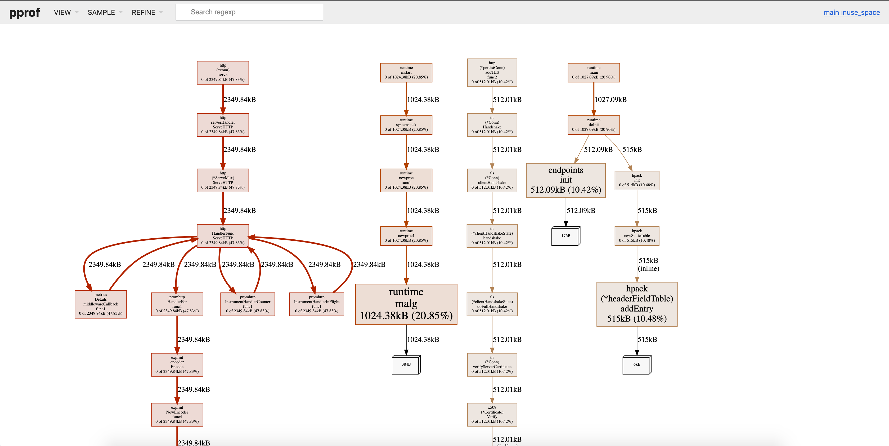
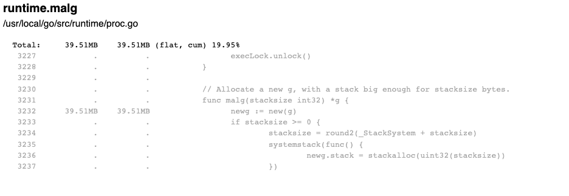
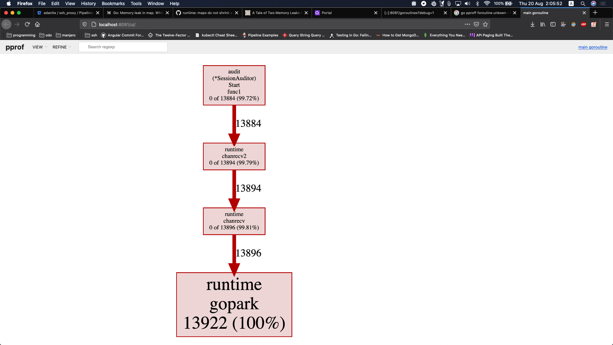

> 本文是 [Golang-Memory-Leaks](https://yuriktech.com/2020/11/07/Golang-Memory-Leaks/) 的中文翻译版本，内容仅供学习参考，如有侵权请联系删除。

其他优秀的 ppof 性能分析文章👍👍👍，请参考 [golang pprof 实战](https://blog.wolfogre.com/posts/go-ppof-practice/) 和 [你不知道的 Go 之 pprof](https://darjun.github.io/2021/06/09/youdontknowgo/pprof/)：

最近,我在生产环境中遇到了内存泄漏。我发现某个服务在负载内存在稳步上升，直到进程触发内存溢出异常。经过深入调查，我找到了内存泄漏的源头，以及为什么会发生这种情况。为了诊断问题，我使用了Golang的分析工具`pprof`。在本文中，我将解释什么是pprof，并展示我如何诊断内存泄漏。

### 背景

我们的客户端通过一个代理服务使用我们的系统,我们为其提供访问权限。内存泄漏发生在这个代理服务中。

### 内存泄漏

在收到客户端关于断开连接的投诉后，我开始寻找问题的根源。
我首先做的是检查公司提供的Grafana监控系统，查看代理服务的内存和CPU使用情况。我查看并且比较了3种不同情况下的指标:


*  服务在重启后处于空闲状态
*  服务处于负载状态
*  服务在负载状态下，现在处于空闲状态


所有重叠的线都表示服务处于空闲状态，只有绿色的线表示服务正在接收流量。

从上图中可以看出几个问题

*   当服务处于空闲状态且没有流量时，其内存保持在较低水平
*   当流量停止命中单个机器时，该机器的内存使用率下降，但仍高于其他实例。

在开始性能分析之前，我列出了一些我想排除的事情:

* 我正在使用Golang版本1.12.5，所以我想确保潜在的泄漏不是来自运行时(即使运行时也有问题)。可以在github页面上的[open issues on the github page](https://github.com/golang/go/issues)得到很好的回答。
*   尝试使用激进的垃圾回收[debug.SetGCPercent(10)](https://golang.org/pkg/runtime/debug/#SetGCPercent)
*   手动尝试[debug.FreeOSMemory()](https://golang.org/pkg/runtime/debug/#FreeOSMemory)，运行时主要关注性能，在内存进行垃圾回收之后，为了性能考虑，并不会立即将其释放回操作系统
*   尝试在staging环境中使用小负载测试重现泄漏，以确认我的怀疑。

在完成上面的检查事项并且发现泄漏仍然存在且可以重现之后，我开始使用pprof对服务进行性能分析。

### Golang 性能工具 - pprof

#### 性能分析类型

你可以收集以下几种性能指标

*   goroutine - 当前所有goroutine的堆栈跟踪
*   heap - 所有堆分配的采样
*   threadcreate - 创建新的操作系统线程的堆栈跟踪
*   block - 导致在同步原语上阻塞的堆栈跟踪
*   mutex - 互斥锁的持有者的堆栈跟踪
*   profile - cpu 性能分析
*   trace - 允许在一定时间范围内收集所有分析数据

#### 性能分析示例

为了开始性能分析，我导入了pprof并启动了一个HTTP服务器。

请注意，如果您已经有一个HTTP服务器在运行，那么只需要import pprof就足够了。我已经有一个TCP服务器在运行，所以我添加了另一个goroutine来监听一个单独的端口用于pprof。

```go
import _ "net/http/pprof"

go func() {
	log.Println(http.ListenAndServe("localhost:6060", nil))
}()
```

对于内存泄漏，我们首先从heap开始分析。


要捕获一个性能文件，我们执行以下操作 `curl http://localhost:6060/debug/pprof/heap?seconds=30 > heap.out`.


然后我们用以下命令分析性能文件

`go tool pprof heap.out`.


*   in_use - 当前的使用情况  

    
*   alloc - 从程序开始运行以来的总分配情况，无论内存是否已被释放。

    

输入top将显示内存消耗排名的前10个结果。我们可以在top后面写任意数字来查看前面的结果。

我们有两个重要的字段需要注意：

- flat - 此函数分配了多少内存
- cum - 此函数或其在堆栈中调用的函数分配了多少累积内存


pprof还提供了一个Web界面，用于可视化检查性能分析文件。

要使用Web界面运行pprof，执行命令`go tool pprof -http=':8081' heap.out`，请注意http标志。

性能分析文件中的最大内存消耗者将显示为红色，这些是您的参考点。

在下面的图片中，我们可以看到有两条红色路径，一个是用于HTTP服务器，另一个是用于runtime.malg。



### 分析内存泄漏

Pprof还有另一个有用的功能，允许使用`-base`和`-diff_base`标志来比较性能文件。所以我们可以这样运行`go tool pprof -http=':8081' -diff_base heap-new-16:22:04:N.out heap-new-17:32:38:N.out`


在收集了服务流量之前和之后的30秒性能文件之后，我比较了这些文件。并对比了这些文件。其中，立即引起我的注意的是内存增长的`runtime.malg`。
> `runtime.malg`是Go语言运行时系统中的一个函数，用于执行内存分配。它是分配器（allocator）的一部分，负责在程序运行时动态分配内存空间。函数的主要作用是管理和分配堆内存。当程序需要分配内存时，它会被调用来获取一块适当大小的内存块，并返回指向该内存块的指针。该函数还负责跟踪内存的使用情况，并在需要时从操作系统中请求更多的内存。
在性能分析中，如果`runtime.malg`在多个采样中占用了大量的内存，那么它可能是内存消耗的主要原因之一。对于该函数的内存增长进行分析可以帮助开发人员确定是否存在内存泄漏或过度分配的问题，并进行相应的优化和改进。

 

在空闲时，runtime.malg应该大约为1MB，现在它增长到了38MB。当创建一个新的goroutine时，会调用runtime.malg函数。它为新创建的goroutine分配一个堆栈跟踪，并在goroutine执行结束之前保持对其的引用。



### 问题定位


到目前为止，pprof指向了runtime.malg，它保存了所有没有被垃圾回收的goroutine描述符。

**一个从未被垃圾回收的goroutine意味着它从未完成执行，这种情况发生在两种情况下**。

*   **一个没有停止条件的`for{}`或`select{}`循环**。
*   **一个等待消息但未正确关闭的`channel`**。
 
为了确认我的怀疑，我检查了一个goroutine的profile，看起来像这样



上述的性能分析文件显示，我有很多无用的goroutine被创建出来，因为它们正在等待一个channel。

我立即查看了性能分析文件所指向的代码片段，并找到了以下内容：

```go
go func() {
  for {
    select {
    case <-sa.reader.C:
      sa.read()
    }
  }
}()
```
该goroutine具有一个`for`循环，它始终监听来自`time.Ticker`的channel。检查`time.Ticker`的停止方式如下所示：

```go
sa.reader.Stop()
```

Looking at the [documentation](https://golang.org/pkg/time/#Ticker.Stop) of time.Ticker, I noticed this

查看`time.Ticker`的[文档](https://golang.org/pkg/time/#Ticker.Stop)，我注意到了以下内容：

> `Stop`函数用于关闭一个`Ticker`。调用`Stop`后，将不再发送任何tick。`Stop不会关闭channel`，以防止并发的goroutine在从该channel读取时看到错误的“tick”。

我立即意识到，该channel从未被关闭，这导致goroutine永远处于等待状态，进而导致`runtime.malg`累积了大量的goroutine描述符，从而增加了堆内存，直到出现OOM异常。

我向goroutine添加了一个`done` channel，并确保在调用`ticker.Stop()`时关闭它。

```go
type Reader struct {
	reader            *time.Ticker
	readerDone        chan bool
}

func NewReader() *Reader {
  return &Reader{
    readerDone: make(chan bool, 1),
    reader: time.NewTicker(time.Second * 5)
  }
}


func (r *Reader) Read(){
  go func() {
    for {
      select {
      case <-r.reader.C: 
        
      case <-r.readerDone:
        return 
      }
    }
  }()
}


func (r *Reader) Stop(){
  r.reader.Stop()
  r.readerDone <- true
}
```

### 总结

上述的内存泄漏问题最终被确认为一个被遗忘的channel导致的goroutine泄漏。当goroutine永远不会完成执行时，就会发生goroutine泄漏，这导致它们的堆栈保留在堆上并且永远不会被垃圾回收，最终导致内存不足异常。

几乎总是应用程序自身造成的问题导致了内存泄漏，但当我处理了几个这样的问题后，我注意到从小事情入手会更容易，例如检查运行时的GitHub页面是否有新的问题报告，或者如果泄漏发生在新版本发布后，与之前没有泄漏的旧版本进行比较。这些小事情可以节省您数十甚至数百个性能分析的时间。无论您选择从何处开始，pprof都可以帮助您。pprof是Golang的性能分析工具，可以让您获取CPU、堆、操作系统线程和goroutine的性能分析文件，并进行可视化比较。

### 参考文章

*   [memory-leaking](https://go101.org/article/memory-leaking.html)
*   [how-we-tracked-down-a-memory-leak-in-one-of-our-go-microservices](https://blog.detectify.com/2019/09/05/how-we-tracked-down-a-memory-leak-in-one-of-our-go-microservices/)
*   [how-i-investigated-memory-leaks-in-go-using-pprof-on-a-large-codebase](https://www.freecodecamp.org/news/how-i-investigated-memory-leaks-in-go-using-pprof-on-a-large-codebase-4bec4325e192/)

