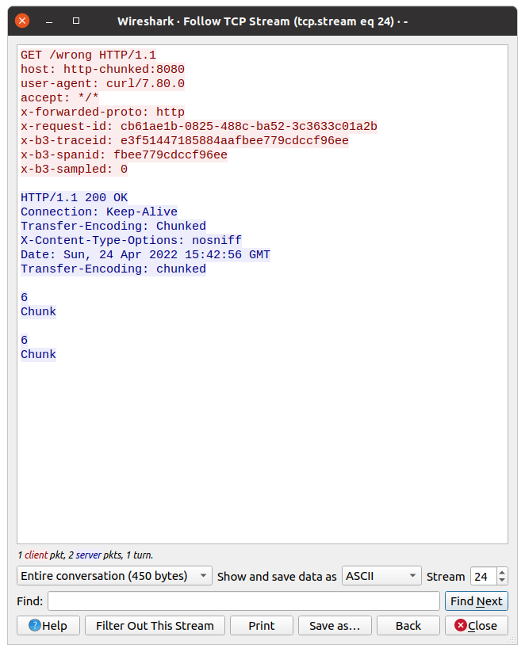

> 本文是[How to debug Istio Upstream Reset 502 UPE (old 503 UC)](https://mjasion.pl/posts/kubernetes/how-to-debug-istio-upstream-reset/)的中文翻译版本，内容有删减

[Istio](https://istio.io/) 是一个复杂的系统。对于应用程序来说，它的主要组件是 sidecar 容器 Istio-Proxy，它代理 Pod 中所有容器的流量。而这可能会导致一些问题。

问题重现🐛
---------------------------------
在一个拥有超过 40 个不同微服务的大型系统中，QA工程师在单个端点上发现了一个bug。这该端点是 POST 端点，它返回分块（chunked）数据。


然后我们发现 Istio 返回了 502 错误，Istio日志中还有一个额外的标志：`upstream_reset_before_response_started`。然而应用程序日志证实了结果是正确的。

> 在旧版本的 Istio 中，它会返回 `503` 错误，带有 `UC` 标志。

问题分析⛏️
------------------
让我们看看 `curl` 的响应，以及 Istio-proxy 的日志：


```shell
kubectl exec -it curl-0 -- curl http://http-chunked:8080/wrong -v
< HTTP/1.1 502 Bad Gateway
< content-length: 87
< content-type: text/plain
< date: Sun, 24 Apr 2022 12:28:28 GMT
< server: istio-envoy
< x-envoy-decorator-operation: http-chunked.default.svc.cluster.local:8080/*
upstream connect error or disconnect/reset before headers. reset reason: protocol error

$ kubectl logs http-chunked-0 -c istio-proxy
[2022-04-24T12:23:37.047Z] "GET /wrong HTTP/1.1" 502 UPE upstream_reset_before_response_started{protocol_error} - "-" 0 87 1001 - "-" "curl/7.80.0" "3987a4cb-2e0e-4de6-af66-7e3447600c73" "http-chunked:8080" "10.244.0.17:8080" inbound|8080|| 127.0.0.6:39063 10.244.0.17:8080 10.244.0.14:35500 - default

```

侦查🕵️问题
----------------------- 
为了分析整个应用程序的流量，我们可以使用 `tcpdump` 和 `Wireshark`。此时Istio-proxy 作为 `sidecar` 运行，并将所有出入 pod 的流量路由到自己的代理进行处理。


有三种方式可以用来嗅探流量：

1.  在`istio-proxy`中运行`tcpdump`
2.  使用 `kubectl` 插件 `ksinff` ，它可以从 pod 中转储数据包[github repo](https://github.com/eldadru/ksniff)
3.  额外添加一个容器到 pod 中，该容器具有 `root` 权限和`tcpdump` 的权限

上述第一种方式方案默认是不起作用的，因为 `istio-proxy` 是以非 root 权限运行的。第三种方式是第一种和第二种方案都不起作用时的备选方案。让我们尝试一下 [ksniff](https://github.com/eldadru/ksniff)

### 什么是 ksniff 🛠️

`ksniff` 是一个插件，它可以：

*   确定哪个node运行着带有应用程序的 Pod,
*   然后部署一个自己的 pod，和node的affinity绑定，并绑定到主机网络，
*   在笔记本的 Wireshark 中记录从应用程序中获取的网络数据包
让我们来执行一下，来嗅探我们的应用程序的网络数据包：


```shell
kubectl sniff http-chunked-0 -c istio-proxy -p -f '-i lo' -n default
```

> **参数解析** 
> *   `-p`是用来支持在非priviledged的pod上运行，可以查看[文档](https://github.com/eldadru/ksniff#non-privileged-and-scratch-pods)来获取更多的信息
> * `-f '-i lo'` 传递给 tcpdump 的过滤器，我们想要在 Pod 内部的localhost上嗅探流量   

 
如果此时没有问题，并且你的系统在 PATH 中安装了 Wireshark，`ksniff` 应该会打开一个新的窗口


### 寻找本因 🔎

Wireshark 将会持续跟踪新的数据包记录。这使得我们很难找到我们想要查找的网络数据。我们可以使用filters来帮助搜索。通过设置请求路径、方法、响应代码，我们可以使用filters来找到我们的数据包：

```shell
http.request.uri == "/wrong"
```


现在它只显示了一个数据包，即我们需要的请求。Wireshark 允许我们显示整个 TCP 会话：

*   右键单击数据包,
*   选择 `Conversation Filter`,
*   选择 `TCP`.

Wireshark将应用一个filter，然后我们就可以在Wireshark看到 Istio 代理容器和应用程序容器之间的整个通信！


让我们仔细看看上图。前三个记录是TCP三次握手数据包。之后是我们发送的 GET 请求。最有趣的是最后两个数据包。应用程序容器返回了 HTTP 200 OK 响应。`istio-proxy`随后用 `RST` 数据包关闭了连接。


这正是我们在日志中看到的 `upstream_reset_before_response_started{protocol_error}`，但root cause此时仍不明确。

###  Wireshark的瑞士军刀 🪛


然而从多个数据包体中读取 HTTP 数据流的具体细节很困难。但 Wireshark 也有解决办法。我们可以在Wireshark看到来自 L7 层即应用层的的数据。在我们的例子中，它是 HTTP 协议。


右键单击单个数据包，进入 `Follow` 选项卡，选择 `TCP Stream`




现在，我们可以检查来自 `istio-proxy` 的请求是什么，以及应用程序的响应是什么。从上面的图片中，你能有什么启发吗？


仔细看一下响应，会发现有一个重复的`Transfer-Encoding` 头。一个以大写字母开头，另一个没有。

然后，我找到了 Istio 中的这个 [issue](https://github.com/istio/istio/issues/24753#issuecomment-656380098)。其中最重要的两点是：

> 1. 根据 RFC，`transfer-encoding: chunked` 和 `transfer-encoding: chunked, chunked` 是等价的

> 2. `transfer-encoding: chunked, chunked` 与 `transfer-encoding: chunked` 的语义不同

为什么HTTP响应被认为是double-chunked的呢？根据 [Section 4](https://datatracker.ietf.org/doc/html/rfc7230#section-4) 中的 Transfer Codings，传输编码名称是**不区分大小写**的。


总结 📓
----------

正如你所看到的，Istio 是我们应用程序中的HTTP 的守护者👮‍♂️。如果应用程序返回了一个double-chunked 响应，那么 Istio 就要求它，否则它就会拒绝处理请求。而`curl` 会忽略这种不一致性。
###  Istio 和 Transfer-Encoding 的技术细节补充
好的，以下是针对上述内容的 Istio 和 Transfer-Encoding 的技术细节：


#### Istio 支持以下 HTTP 传输编码：

- chunked：将响应分成多个块，每个块以长度为 1 到 2 个字节的十六进制数表示。
- identity：将响应原样传输。
- deflate：使用 DEFLATE 压缩算法压缩响应。
- gzip：使用 GZIP 压缩算法压缩响应。
Istio 使用 HTTP 传输编码来实现以下功能：

####  Transfer-Encoding 头

`Transfer-Encoding` 头用于指定 HTTP 响应使用何种传输编码。Transfer-Encoding 头的格式如下：

`Transfer-Encoding`: `<transfer-encoding>`
其中，`<transfer-encoding>` 是传输编码的名称。

在 Istio 中，如果应用程序返回的响应中包含重复的 `Transfer-Encoding` 头，Istio 将拒绝该响应。这是因为 Istio 要求响应中只能包含一个 `Transfer-Encoding` 头。

如何复现 🏭
----------------------------------------------

你可以在 [Github repository](https://github.com/mjasion/istio-upstream-reset) 找到重现这个问题的代码。

上述示例应用程序暴露了两个端点：

*   `/correct` -  创建一个流式响应，它返回一个正确的响应
*   `/wrong` - 它返回一个错误的响应，因为它的 `Transfer-Encoding` 是大写`Chunked`，而不是 小写`chunked`。

