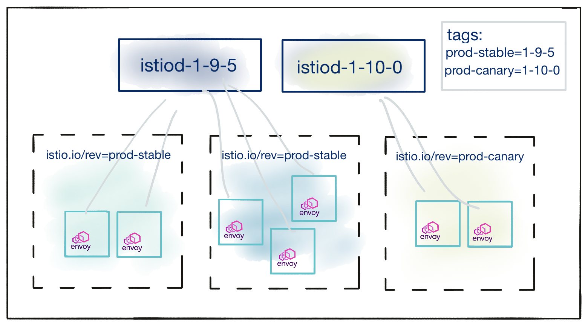

# How to install multi istio control plane in one k8s cluster

### 准备工作
首先我们创建两个NameSpace`istio-canary` & `istio-prod`,分别用于部署istio的canary版本和prod版本，然后我们给这两个NameSpace打上标签，用于后续的istio的版本选择。
```bash
➜ ~ k create ns istio-canary
➜ ~ k create ns istio-prod
➜ ~ k label ns istio-canary istio-tag=istio-canary
➜ ~ k label ns istio-prod istio-tag=istio-prod
```

接下来我们将要安装istio的版本，这里我们选择了1.19.3和1.18.5两个版本，分别用于canary和prod的版本。

```bash
➜ ~ curl -L https://istio.io/downloadIstio | ISTIO_VERSION=1.19.3 sh -

➜ ~ curl -L https://istio.io/downloadIstio | ISTIO_VERSION=1.18.5 sh -
```
首先给两个版本的istioctl设置alias，方便后续的操作。
```bash
➜ ~ istioctl1.9='~/istio-1.19.3/bin/istioctl'
➜ ~ istioctl1.8='~/istio-1.18.5/bin/istioctl'
```

### 开始安装istio
我们使用下面的命令来在istio-canary的NameSpace中安装istio 1.19.3版本
```bash 
➜ ~ istioctl1.9 install -y -f - <<EOF
apiVersion: install.istio.io/v1alpha1
kind: IstioOperator
metadata:
  namespace: istio-canary
  name: istio-1-19-3
spec:
  profile: default
  revision: 1-19-3
  tag: 1.19.3
  meshConfig:
    discoverySelectors:
      - matchLabels:
          istio-tag: istio-canary     
  values:
    global:
      istioNamespace: istio-canary
    pilot:
      env:
        ENABLE_ENHANCED_RESOURCE_SCOPING: true
EOF
✔ Istio core installed
✔ Istiod installed
✔ Ingress gateways installed
✔ Installation complete
```

我们使用下面的命令来在istio-prod的NameSpace中安装istio 1.18.5版本
```bash 
~ istioctl1.8 install -y -f - <<EOF
apiVersion: install.istio.io/v1alpha1
kind: IstioOperator
metadata:
  namespace: istio-prod
  name: istio-1-18-5
spec:
  profile: default
  revision: 1-18-5
  tag: 1.18.5
  meshConfig:
    discoverySelectors:
      - matchLabels:
          istio-tag: istio-prod     
  values:
    global:
      istioNamespace: istio-prod
    pilot:
      env:
        ENABLE_ENHANCED_RESOURCE_SCOPING: true
EOF
✔ Istio core installed
✔ Istiod installed
✔ Ingress gateways installed
✔ Installation complete
```

### 查看istio的安装情况
首先查看istio-prod这个namespace中的pod的状态
```bash
➜ ~ k get pod -n istio-prod
NAME                                    READY   STATUS    RESTARTS   AGE
istio-ingressgateway-64b4ff6975-q4k7b   1/1     Running   0          114s
istiod-1-18-5-6f9cf7dcc4-84jvl          1/1     Running   0          4m4s
```
然后查看istio-canary这个namespace中的pod的状态
```bash
➜ ~ k get pod -n istio-canary
NAME                                    READY   STATUS    RESTARTS   AGE
istio-ingressgateway-6f8bb55cf7-kqzq9   1/1     Running   0          6m31s
istiod-1-19-3-64857b74d8-b5d5g          1/1     Running   0          6m39s
```
使用下面的命令查看istio-prod和istio-canary这两个namespace的label
```bash
➜ ~ k get ns istio-canary --show-labels
NAME           STATUS   AGE     LABELS
istio-canary   Active   9m53s   istio-tag=istio-canary,kubernetes.io/metadata.name=istio-canary
➜ ~ k get ns istio-prod --show-labels
NAME         STATUS   AGE     LABELS
istio-prod   Active   9m39s   istio-tag=istio-prod,kubernetes.io/metadata.name=istio-prod
```
使用下面的命令查看与istio-1-19-3和istio-1-18-5相关的validatingWebhook和mutatingWebhook的配置
```bash
➜ ~ k get validatingwebhookconfiguration ｜ grep istio
NAME                                           WEBHOOKS   AGE
istio-validator-1-18-5-istio-prod              1          4m36s
istio-validator-1-19-3-istio-canary            1          7m5s

➜ ~ k get mutatingwebhookconfiguration｜ grep istio
NAME                                           WEBHOOKS   AGE
istio-revision-tag-default-istio-canary        4          7m
istio-sidecar-injector-1-18-5-istio-prod       2          4m56s
istio-sidecar-injector-1-19-3-istio-canary     2          7m25s
```

### 后续工作
接下来我们给istio 1.19.3和1.18.5设置一个新的tag，分别为prod-canary和prod-stable
```bash
➜ ~ istioctl1.9 x revision tag set prod-canary --revision 1-19-3
creating tag would conflict, pass --skip-confirmation to proceed:
Error [IST0139] (MutatingWebhookConfiguration istio-revision-tag-prod-canary ) Injector refers to a control plane service that does not exist: istio-system/istiod-1-19-3.
Apply anyways? [y/N] y
Revision tag "prod-canary" created, referencing control plane revision "1-19-3". To enable injection using this
revision tag, use 'kubectl label namespace <NAMESPACE> istio.io/rev=prod-canary'

➜ ~ istioctl1.8 x revision tag set prod-stable --revision 1-18-5
creating tag would conflict, pass --skip-confirmation to proceed:
Error [IST0139] (MutatingWebhookConfiguration istio-revision-tag-prod-stable ) Injector refers to a control plane service that does not exist: istio-system/istiod-1-18-5.
Apply anyways? [y/N] y
Revision tag "prod-stable" created, referencing control plane revision "1-18-5". To enable injection using this
revision tag, use 'kubectl label namespace <NAMESPACE> istio.io/rev=prod-stable'
```
使用下面的命令查看现有的istio的tag
```bash
➜ ~  istioctl1.9 x revision tag list
TAG         REVISION NAMESPACES
default     1-19-3
prod-canary 1-19-3
prod-stable 1-18-5
```
给`l7-traffic-alpha`和`l7-traffic-beta`这两个NameSpace添加标签`istio.io/rev=prod-canary`和`istio.io/rev=prod-stable`

```bash
➜ ~ k label ns l7-traffic-alpha istio.io/rev=prod-canary
namespace/l7-traffic-alpha labeled
➜ ~ k label ns l7-traffic-alpha istio-tag=istio-canary
namespace/l7-traffic-alpha labeled
➜ ~ k label ns l7-traffic-beta istio.io/rev=prod-stable
namespace/l7-traffic-beta labeled
➜ ~ k label ns l7-traffic-beta istio-tag=istio-prod
namespace/l7-traffic-beta labeled

```
再检查一下现有的istio的tag，我们可以看到现在的tag`prod-canary`和`prod-stable`已经在`l7-traffic-alpha`和`l7-traffic-beta`这两个NameSpace中生效了

```bash
➜ ~ istioctl1.9 x revision tag list
TAG         REVISION NAMESPACES
default     1-19-3
prod-canary 1-19-3   l7-traffic-alpha
prod-stable 1-18-5   l7-traffic-beta
```

### 卸载
我们可以使用下面的命令来卸载istio
```bash
➜ ~ istioctl uninstall --revision istio-canary
# failed to get proxy infos: unable to find any Istiod instances
#   Removed IstioOperator:istio-canary:installed-state-istio-canary.
#   Removed Deployment:istio-canary:istiod-istio-canary.
#   Removed Service:istio-canary:istiod-istio-canary.
#   Removed ConfigMap:istio-canary:istio-istio-canary.
#   Removed ConfigMap:istio-canary:istio-sidecar-injector-istio-canary.
#   Removed Pod:istio-canary:istiod-istio-canary-775df986c-f97rg.
#   Removed ServiceAccount:istio-canary:istiod-istio-canary.
#   Removed RoleBinding:istio-canary:istiod-istio-canary.
#   Removed Role:istio-canary:istiod-istio-canary.
#   Removed HorizontalPodAutoscaler:istio-canary:istiod-istio-canary.
#   Removed PodDisruptionBudget:istio-canary:istiod-istio-canary.
#   Removed MutatingWebhookConfiguration::istio-sidecar-injector-istio-canary-istio-canary.
#   Removed ValidatingWebhookConfiguration::istio-validator-istio-canary-istio-canary.
#   Removed ClusterRole::istio-reader-clusterrole-istio-canary-istio-canary.
#   Removed ClusterRole::istiod-clusterrole-istio-canary-istio-canary.
#   Removed ClusterRole::istiod-gateway-controller-istio-canary-istio-canary.
#   Removed ClusterRoleBinding::istio-reader-clusterrole-istio-canary-istio-canary.
#   Removed ClusterRoleBinding::istiod-clusterrole-istio-canary-istio-canary.
#   Removed ClusterRoleBinding::istiod-gateway-controller-istio-canary-istio-canary.
# ✔ Uninstall complete
```

### 总结

本文主要介绍了如何在一个k8s集群中安装多个istio的control plane，以及如何使用revision和tag来管理多个istio的control plane。后续的文章会介绍如何在多个istio的环境中部署自己的应用。


### 参考文章
- [multiple-controlplanes](https://istio.io/latest/docs/setup/install/multiple-controlplanes/)
- [Safely upgrade the Istio control plane with revisions and tags](https://istio.io/v1.16/blog/2021/revision-tags/)
- [Istio Operator Install](https://istio.io/latest/docs/setup/install/operator/#canary-upgrade)
- [IstioOperator Options](https://istio.io/latest/docs/reference/config/istio.operator.v1alpha1/)
- [discovery selectors](https://istio.io/v1.16/blog/2021/discovery-selectors/)
- [sidecar-injection](https://istio.io/latest/docs/setup/additional-setup/sidecar-injection/)