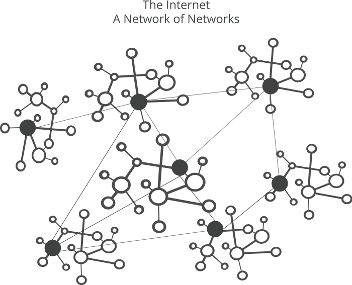
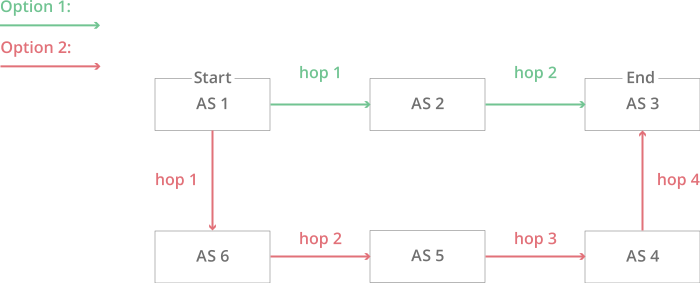

> [What is BGP? | BGP routing explained](https://www.cloudflare.com/learning/security/glossary/what-is-bgp/) 的中文翻译版本,内容有删减

> 其他BGP相关的文章: [border-gateway-protocol-bgp](https://www.imperva.com/learn/ddos/border-gateway-protocol-bgp/)

What is BGP?（BGP是什么）
------------

Border Gateway Protocol (BGP) is the postal service of the Internet. When someone drops a letter into a mailbox, the Postal Service processes that piece of mail and chooses a fast, efficient route to deliver that letter to its recipient. Similarly, when someone submits data via the Internet, BGP is responsible for looking at all of the available paths that data could travel and picking the best route, which usually means hopping between autonomous systems.

边界网关协议（BGP）可以类比为互联网的邮政服务。当有人将一封信放入邮箱时，邮政服务会处理该邮件，并选择一条快速、有效的线路将该信递送给收件人。同样当有人通过互联网提交数据时，BGP 负责查看数据可以传输的所有可用路径，并选择最佳路由，这通常意味着在自治系统之间跳转。

BGP is the protocol that makes the Internet work by enabling data routing. When a user in Singapore loads a website with [origin servers](https://www.cloudflare.com/learning/cdn/glossary/origin-server/) in Argentina, BGP is the [protocol](https://www.cloudflare.com/learning/network-layer/what-is-a-protocol/) that enables that communication to happen quickly and efficiently.

BGP 是通过启用数据路由, 然后使互联网工作的协议。当一个新加坡的用户访问[服务器](https://www.cloudflare.com/learning/cdn/glossary/origin-server/)位于阿根廷的网站时，此时BGP就是使通信能够快速有效地发生的[协议](https://www.cloudflare.com/learning/network-layer/what-is-a-protocol/)。

What is an autonomous system?(什么是自治系统)
-----------------------------

The Internet is a network of networks. It is broken up into hundreds of thousands of smaller networks known as [autonomous systems (ASes)](https://www.cloudflare.com/learning/network-layer/what-is-an-autonomous-system/). Each of these networks is essentially a large pool of routers run by a single organization.

互联网是一个小型网络的集合。它由数十万个较小的被称为[自治系统](https://www.cloudflare.com/learning/network-layer/what-is-an-autonomous-system/)网络构成。这些子网络本质上都是由单个组织运行的大型路由器池。



If we continue to think of BGP as the Postal Service of the Internet, ASes are like individual post office branches. A town may have hundreds of mailboxes, but the mail in those boxes must go through the local postal branch before being routed to another destination. The internal routers within an AS are like mailboxes. They forward their outbound transmissions to the AS, which then uses BGP routing to get these transmissions to their destinations.

如果我们继续将BGP类比互联网中的邮政服务，那么AS就像单个邮局分支机构。一个城镇可能有数百个邮箱，但这些邮箱中的邮件必须通过当地的邮政分支机构，然后才能发送到另一个目的地。AS内部的路由器类似于邮箱。它们将其出站信息转发到 AS，然后 AS 使用 BGP 路由将这些信息传输到目的地。


The diagram above illustrates a simplified version of BGP. In this version there are only six ASes on the Internet. If AS1 needs to route a packet to AS3, it has two different options:



上图是 BGP 的简化版本。在这个版本中，互联网上只有六个 AS。如果 AS1 需要将数据包路由到 AS3，则它有两个不同的选项：

- Hopping to AS2 and then to AS3:
- 数据先到 AS2，然后到 AS3：

```
AS2 → AS3
```

- Or hopping to AS6, then to AS5, AS4, and finally to AS3:
- 或者数据先到 AS6，然后到 AS5、AS4，最后到 AS3：

```
AS6 → AS5 → AS4 → AS3
```

In this simplified model, the decision seems straightforward. The AS2 route requires fewer hops than the AS6 route, and therefore it is the quickest, most efficient route. Now imagine that there are hundreds of thousands of ASes and that hop count is only one part of a complex route selection algorithm. That is the reality of BGP routing on the Internet.

在这个简化的BGP模型中，我们可以很明确地做出决定: AS2 路由比 AS6 路由需要的跳数少，因此它是最快速、最有效的路由。现在想象一下有数十万个 AS，而且跳数只是复杂路由选择算法的一部分。这就是互联网上 BGP 路由的现实。

The structure of the Internet is constantly changing, with new systems popping up and existing systems becoming unavailable. Because of this, every AS must be kept up to date with information regarding new routes as well as obsolete routes. This is done through peering sessions where each AS connects to neighboring ASes with a [TCP/IP](https://www.cloudflare.com/learning/ddos/glossary/tcp-ip/) connection for the purpose of sharing routing information. Using this information, each AS is equipped to properly route outbound data transmissions coming from within.

互联网的拓扑一直在不断变化，新的系统不断出现，已有的系统会面临变得不可用的情况。因此，每个 AS 必须保持**新路由**和**旧路由**的信息保持同步。这是通过会话完成的，其中每个 AS 通过 [TCP/IP](https://www.cloudflare.com/learning/ddos/glossary/tcp-ip/) 连接连接到相邻的 AS，以便共享路由信息。通过使用此信息，每个 AS 都能够正确路由来自内部的出站数据传输。

Here is where part of our analogy falls apart. Unlike post office branches, autonomous systems are not all part of the same organization. In fact, they often belong to competing businesses. For this reason, BGP routes sometimes take business considerations into account. ASes often charge each other to carry traffic across their networks, and the price of access can be factored into which route is ultimately selected.

这就是我们的比喻开始失效的地方。与邮局分支不同，自治系统并非都是同一组织的一部分。事实上，它们通常属于竞争企业。因此，BGP 路由有时会考虑业务注意事项。AS通常相互收费以在其网络中传输流量，并且访问价格会影响最终选择的路由

Who operates BGP autonomous systems? (谁在运营BGP自制系统)
------------------------------------

ASes typically belong to Internet service providers (ISPs) or other large organizations, such as tech companies, universities, government agencies, and scientific institutions. Each AS wishing to exchange [routing](https://www.cloudflare.com/learning/network-layer/what-is-routing/) information must have a registered autonomous system number (ASN). Internet Assigned Numbers Authority (IANA) assigns ASNs to Regional Internet Registries (RIRs), which then assigns them to ISPs and networks. ASNs are 16 bit numbers between one and 65534 and 32 bit numbers between 131072 and 4294967294. As of 2018, there are approximately 64,000 ASNs in use worldwide. These ASNs are only required for external BGP.

AS 通常属于互联网服务提供商 （ISP） 或其他大型组织，例如科技公司、大学、政府机构和科学机构。每个希望交换[路由](https://www.cloudflare.com/learning/network-layer/what-is-routing/)信息的AS必须具有注册的自治系统编号（简称ASN）。互联网号码分配机构 （IANA） 将 ASN 分配给区域互联网注册机构 （RIR），然后由RIR将其分配给 ISP 和网络。ASN 是介于 1 和 65534 之间的 16 位数字和介于 131072 和 4294967294 之间的 32 位数字。截至 2018 年，全球约有 64，000 个 ASN 在使用中。这些 ASN 仅 eBGP 需要。

What is the difference between external BGP and internal BGP? (eBGP和iBGP的区别是什么)
-------------------------------------------------------------

Routes are exchanged and traffic is transmitted over the Internet using external BGP (eBGP). Autonomous systems can also use an internal version of BGP to route through their internal networks, which is known as internal BGP (iBGP). It should be noted that using internal BGP is NOT a requirement for using external BGP. Autonomous systems can choose from a number of internal protocols to connect the routers on their internal network.

路由是通过 eBGP 交换的，流量是通过 eBGP 传输的。自治系统还可以使用 BGP 的内部版本来路由其内部网络，这称为 iBGP。应该注意的是，使用 iBGP 不是使用 eBGP 的要求。自治系统可以从多种内部协议中选择一个来连接其内部网络上的路由器。

AS使用外部 BGP （eBGP） 交换路由并通过互联网传输流量。同时AS还可以使用内部 BGP （iBGP）通过其内部网络进行路由。应该注意的是，iBGP不是eBGP的强制要求。AS可以从许多内部协议中进行选择，以连接其内部网络上的路由器。

External BGP is like international shipping. There are certain standards and guidelines that need to be followed when shipping a piece of mail internationally. Once that piece of mail reaches its destination country, it has to go through the destination country’s local mail service to reach its final destination. Each country has its own internal mail service that does not necessarily follow the same guidelines as those of other countries. Similarly, each autonomous system can have its own internal routing protocol for routing data within its own network.

eBGP就像国际运输。在国际上运送邮件时，需要遵循某些标准和准则。一旦该邮件到达目的地国家，它必须通过目的地国家的本地邮件服务才能到达最终目的地。每个国家都有自己的内部邮件服务，不一定遵循与其他国家/地区相同的准则。同样，每个自治系统都可以有自己的内部路由协议，用于在自己的网络中路由数据。

BGP flaws and how to address them (BGP的缺陷以及如何解决)
---------------------------------

In 2004, a Turkish ISP called TTNet accidentally advertised incorrect BGP routes to its neighbors. These routes claimed that TTNet itself was the best destination for all traffic on the Internet. As these routes spread further and further to more autonomous systems, a massive disruption occurred, creating a one-day crisis where many people across the world were not able to access some or all of the Internet.

2004年，一家名为TTNet的土耳其ISP意外地向其邻居宣传了错误的BGP路由。这些路由声称TTNet本身是互联网上所有流量的最佳目的地。随着这些路由传播到越来越多的AS，发生了大规模的中断，造成了一天的危机，世界各地的许多人无法访问部分或全部互联网。

Similarly, in 2008, a Pakistani ISP attempted to use a BGP route to block Pakistani users from visiting YouTube. The ISP then accidentally advertised these routes with its neighboring ASes and the route quickly spread across the Internet’s BGP network. This route sent users trying to access YouTube to a dead end, which resulted in YouTube’s being inaccessible for several hours.

同样，在2008年，巴基斯坦ISP试图使用BGP路由阻止巴基斯坦用户访问YouTube。然后，ISP 意外地向相邻的 AS 通告了这些路由，并且该路由迅速传播到互联网的 BGP 网络中。这条路线将试图访问YouTube的用户送入了死胡同，导致YouTube在几个小时内无法访问。

These are examples of a practice called [BGP hijacking](https://www.cloudflare.com/learning/security/glossary/bgp-hijacking/), which does not always happen accidentally. In April 2018, attackers deliberately created bad BGP routes to redirect traffic that was meant for Amazon’s [DNS](https://www.cloudflare.com/learning/dns/what-is-dns/) service. The attackers were able to steal over $100,000 worth of [cryptocurrency](https://www.cloudflare.com/learning/ddos/cryptocurrency-ddos-attacks/) by redirecting the traffic to themselves.

这些做法被称为[BGP劫持](https://www.cloudflare.com/learning/security/glossary/bgp-hijacking/)，它并不总是偶然发生。2018 年 4 月，攻击者故意创建不良的 BGP 路由，以重定向用于亚马逊 [DNS](https://www.cloudflare.com/learning/dns/what-is-dns/) 服务的流量。攻击者能够通过将流量重定向到自己来窃取价值超过 100，000 美元的 [加密货币](https://www.cloudflare.com/learning/ddos/cryptocurrency-ddos-attacks/)。

Incidents like these can happen because the route-sharing function of BGP relies on trust, and autonomous systems implicitly trust the routes that are shared with them. When peers announce incorrect route information (intentionally or not), traffic goes where it is not supposed to, potentially with malicious results.

此类事件之所以会发生，**是因为 BGP 的路由共享功能依赖于信任，而自治系统隐式信任与其共享的路由**。当对等方（有意或无意）宣布不正确的路由信息时，流量会流向不应该去的地方，这可能会产生恶意结果。

Fortunately, some progress has been made in securing BGP. Most notably, a security framework for routing called [Resource Public Key Infrastructure (RPKI)](https://blog.cloudflare.com/is-bgp-safe-yet-rpki-routing-security-initiative/) was introduced in 2008. RPKI uses cryptographically signed records called Route Origin Authorization (ROAs) to validate which network operator is allowed to announce an organization’s IP addresses using BGP. This ensures that only authorized parties are announcing an organization’s prefixes.

幸运的是，已经有一些努力来保护BGP。最值得注意的是，2008年引入了一种名为[资源公钥基础架构（RPKI）](https://blog.cloudflare.com/is-bgp-safe-yet-rpki-routing-security-initiative/)的路由安全框架。RPKI使用称为路由源授权（ROAs）的加密签名记录来验证哪个网络运营商被允许使用BGP宣布组织的IP地址。这确保了只有授权的方才能宣布组织的前缀。

But RPKI’s existence alone is not enough. If large networks do not deploy RPKI, they can spread large-scale hijacking attacks. Currently, [over 50% of the top Internet providers support RPKI](https://isbgpsafeyet.com/) to some extent, but a larger majority is needed to fully secure BGP. Network operators can protect their networks by implementing RPKI and using network alerting technology like [Cloudflare Route Leak Detection](https://blog.cloudflare.com/route-leak-detection/). This feature helps prevent BGP hijacking attacks by letting customers know when unauthorized parties are advertising their prefixes.

但仅靠RPKI的存在是不够的。如果大型网络不部署RPKI，它们可能会传播大规模的劫持攻击。目前，[超过50％的顶级互联网提供商在某种程度上支持RPKI](https://isbgpsafeyet.com/)，但需要更多的大多数才能完全保护BGP。网络运营商可以通过实施RPKI和使用网络警报技术（如[Cloudflare路由泄漏检测](https://blog.cloudflare.com/route-leak-detection/)）来保护网络。此功能可通过在未经授权的方宣传其前缀时通知客户来防止BGP劫持攻击。