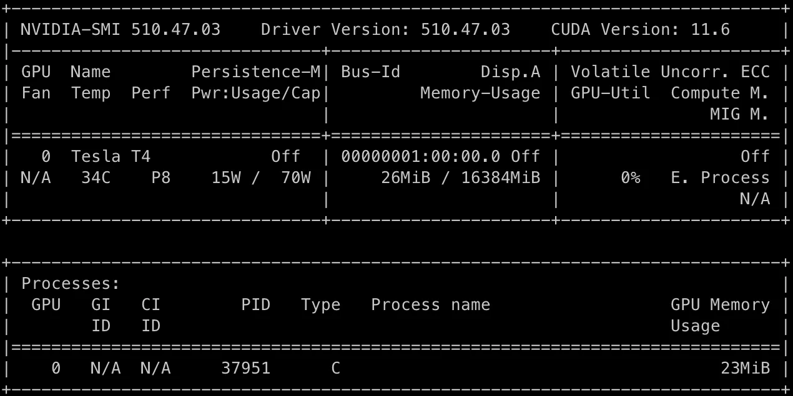

> 本文由[How to Increase GPU Utilization in Kubernetes with NVIDIA MPS](https://towardsdatascience.com/how-to-increase-gpu-utilization-in-kubernetes-with-nvidia-mps-e680d20c3181)的中文翻译版本，内容有删减

> 本文主要介绍在 Kubernetes 中集成 NVIDIA 多进程服务（MPS,Multi-Process Service），以在工作负载之间共享 GPU，以最大化利用率并降低基础设施成本。


大多数workload不需要每个 GPU 的全部内存和计算资源。因此，将一个 GPU 在多个进程之间共享对于提高 GPU 利用率和降低基础设施成本至关重要。


在 Kubernetes 中，可以通过将单个 GPU 公开为多个资源（即切片），每个切片具有特定的内存和计算大小，这些资源可以由单个容器请求来实现。通过为每个容器只创建所需的 GPU 切片，您可以释放集群中富余的GPU资源。这些资源可用于调度更多的 Pod，或允许您减少集群中的GPU节点数。无论哪种方式，在进程之间共享 GPU 都可以帮助您降低基础设施成本。

Kubernetes 中的 GPU 支持由 [NVIDIA Kubernetes Device Plugin](https://github.com/NVIDIA/k8s-device-plugin) 提供，该插件目前仅支持两种 GPU 共享策略：时间切片和多实例 GPU（MIG,Multi-Instance GPU）。但是，还有一种 GPU 共享策略，它平衡了时间切片和 MIG 的优缺点：多进程服务 [**Multi-Process Service (MPS)**](https://docs.nvidia.com/deploy/mps/index.html)。尽管 MPS 不受 NVIDIA Device Plugin 支持，但在 Kubernetes 中使用它仍然可行。

在本文中，我们将首先对比所有三种 GPU 共享技术的优缺点，然后提供有关如何在 Kubernetes 中使用 MPS 的逐步指南。此外，我们还提出了一种自动化 MPS 资源管理的解决方案，以优化利用率并降低运营成本：动态MPS  (**Dynamic MPS Partitioning**)。

目前使用GPU的方式有三种：

1.  **Time slicing**：将 GPU 的使用时间分为多个时间段，并按顺序分配给容器。这是一种简单有效的方法来共享 GPU，但它可能会导致容器的性能不一致。
2.  **Multi-instance GPU (MIG)**：将单个 GPU 分为多个逻辑 GPU，每个逻辑 GPU 可以由一个容器使用。这可以提高 GPU 的利用率，因为每个容器只使用它所需的 GPU 资源。但是，MIG 需要额外的软件和硬件支持，这可能会增加成本。
3.  **Multi-Process Service (MPS)**：将多个 GPU 组合在一起，并由一个进程管理，该进程可以将 GPU 资源分配给多个容器。MPS 可以提供比时间切片和 MIG 更高级的 GPU 共享控制，但它也更复杂。


#### **Time slicing**

时间切片是一种机制，它允许在繁忙的 GPU 上交错地运行用户的workload。时间切片主要是调用GPU 时间切片调度程序，该调度程序通过**时间共享**并发执行多个 CUDA 进程。

当启用时间切片时，GPU 会通过在一定时间间隔内在进程之间切换，以公平共享的方式在不同进程之间共享其计算资源。这会产生与连续上下文切换相关的计算时间开销，这会转化为抖动和更高的延迟。

> 时间切片几乎被所有 GPU 架构支持，是 Kubernetes 集群中共享 GPU 的最简单解决方案。但是，进程之间不断切换会产生计算时间开销。此外，时间切片在共享 GPU 的进程之间不提供任何内存隔离级别，也不提供任何内存分配限制，这可能导致频繁的 OOM（内存不足）错误。

如果您想在 Kubernetes 中使用时间切片，您只需要编辑 NVIDIA Device Plugin 配置。例如，您可以将以下配置应用于具有 2 个 GPU 的节点。该节点上运行的设备插件将向 Kubernetes 申请 8 个 `nvidia.com/gpu` 资源，而不是 2 个。这允许每个 GPU 被最多 4 个容器共享。


```yaml
version: v1
sharing:
  timeSlicing:
    resources:
    - name: nvidia.com/gpu
      replicas: 4
```


如果你想知道关于时间切片在 Kubernetes 中的更多信息，请参考 [NVIDIA GPU Operator documentation](https://docs.nvidia.com/datacenter/cloud-native/gpu-operator/gpu-sharing.html)。

#### Multi-Instance GPU (MIG)

多实例 GPU（Multi-Instance GPU，简称 MIG）是一种在 NVIDIA [Ampere](https://www.nvidia.com/en-us/data-center/ampere-architecture/) 和 [Hopper](https://www.nvidia.com/en-us/data-center/technologies/hopper-architecture/) 架构上可用的技术，允许将 GPU 安全地划分为最多七个独立的 GPU 实例，每个实例都具有自己的高带宽内存、缓存和计算核心。

这些独立的 GPU 切片被称为 MIG 设备，并且它们采用一种格式命名，该格式指示了设备的计算和内存资源。例如，2g.20gb 对应于具有 20 GB 内存的 GPU 切片。

MIG 不允许创建自定义大小和数量的 GPU 切片，因为每个 GPU 型号仅支持一组[特定的 MIG 配置](https://docs.nvidia.com/datacenter/tesla/mig-user-guide/#supported-profiles)。这降低了您对 GPU 进行分区的粒度。此外，MIG 设备必须根据特定的[规则](https://docs.nvidia.com/datacenter/tesla/mig-user-guide/#partitioning)进行创建，这进一步限制了使用的灵活性。
> MIG 是在进程之间提供最高级别隔离的 GPU 共享方法。然而，它缺乏灵活性，并且仅与少数 GPU 架构（Ampere 和 Hopper）兼容。

您可以使用 [nvidia-smi](https://developer.nvidia.com/nvidia-system-management-interface) 命令行界面手动创建和删除 MIG 设备，也可以使用 [NVML](https://developer.nvidia.com/nvidia-management-library-nvml) 进行编程方式操作。然后，NVIDIA 设备插件通过 [不同的命名策略](https://docs.google.com/document/d/1mdgMQ8g7WmaI_XVVRrCvHPFPOMCm5LQD5JefgAh6N8g/edit#bookmark=id.vj44q8ogvavv) 将这些设备作为 Kubernetes 资源公开。例如，使用 `mixed` 策略，设备 `1g.10gb` 会被公开为 `nvidia.com/mig-1g.10gb`。而策略 `single` 则将设备公开为通用的 `nvidia.com/gpu` 资源。


通过 nvidia-smi CLI 或 NVML 手动管理 MIG 设备相对不太实用：在 Kubernetes 中，NVIDIA GPU Operator 提供了一种更简便的方式来使用 MIG，尽管仍然有一些限制。该Operator使用 [ConfigMap](https://docs.nvidia.com/datacenter/cloud-native/gpu-operator/gpu-operator-mig.html#configuring-mig-profiles) 定义了一组允许的 MIG 配置，您可以通过添加label来将其应用于该节点。

您可以编辑此 ConfigMap 来定义您自己的自定义 MIG 配置，就像下面的示例所示。在此示例中，一个节点被标记为 `nvidia.com/mig.config=all-1g.5gb`。因此，GPU Operator 将将该节点的每个 GPU 划分为七个 1g.5gb MIG 设备，然后将其作为 `nvidia.com/mig-1g.5gb` 资源暴露给 Kubernetes 使用。

```yaml
apiVersion: v1
kind: ConfigMap
metadata:
  name: default-mig-parted-config
data:
  config.yaml: |
    version: v1
    mig-configs:
      all-1g.5gb:
        - devices: all
          mig-enabled: true
          mig-devices:
            "1g.5gb": 7
      all-2g.10gb:
        - devices: all
          mig-enabled: true
          mig-devices:
            "2g.10gb": 3
```

为了有效地利用带有 NVIDIA GPU Operator 的集群资源，集群管理员将需要不断修改 ConfigMap，以使 MIG 大小适应不断变化的工作负载计算需求。

这是非常不实际的。尽管这种方法当然比 SSH 连接到节点并手动创建/删除 MIG 设备要好，但对于集群管理员来说，这是非常繁重和耗时的工作。因此，通常情况下，MIG 设备的配置很少会随着时间的推移发生变化，或者根本不会应用，而在这两种情况下，都会导致 GPU 利用率的显著低效，从而增加基础设施成本。

可以通过[Dynamic GPU Partitioning](https://docs.nebuly.com/nos/dynamic-gpu-partitioning/overview/)来克服这一挑战。在本文的后面部分，我们将了解如何使用开源模块 `nos` 动态划分 GPU，并使用 MPS，该方法也适用于 MIG。

#### Multi-Process Service (MPS)

多进程服务（Multi-Process Service，简称 MPS）是CUDA应用编程接口（API）的客户端-服务器实现，用于在同一GPU上并发运行多个进程。

服务器管理GPU访问，为客户端提供并发性。客户端通过客户端运行时连接到服务器，该运行时内置于CUDA驱动库中，并且可以由任何CUDA应用程序透明地调用。

> MPS 几乎与所有现代 GPU 兼容，并提供了最高的灵活性，允许创建具有可分配内存量和可用计算能力的任意限制的 GPU 切片。然而，它不强制在进程之间实现完全的内存隔离。在大多数情况下，MPS 在 MIG 和时间分片之间表示了一个很好的折衷方案。

与时间分片相比，MPS 通过通过“空间共享”在并行中运行进程，从而消除了上下文切换的开销，从而实现更好地计算性能。此外，MPS 为每个进程提供了自己的 GPU 内存地址空间。这允许对进程的内存限制，克服了时间分片共享的限制。

然而，在 MPS 中，客户端进程之间并不完全隔离。实际上，尽管 MPS 允许限制客户端的计算和内存资源，但它不提供错误隔离和内存保护。这意味着一个客户端进程如果崩溃并导致整个 GPU 重置，影响在 GPU 上运行的所有其他进程。

NVIDIA Kubernetes 设备插件不支持 MPS 分区，这使得在 Kubernetes不能直接使用它。在接下来的章节中，我们将探讨通过利用 `nos` 和不同的 Kubernetes 设备插件来充分利用 MPS 进行 GPU 共享的替代方法。

您可以通过使用 Helm 安装[这个分支](https://github.com/nebuly-ai/k8s-device-plugin)的 NVIDIA 设备插件，来在 Kubernetes 集群中启用 MPS 分区：

```shell
helm install oci://ghcr.io/nebuly-ai/helm-charts/nvidia-device-plugin \
  --version 0.13.0 \
  --generate-name \
  -n nebuly-nvidia \
  --create-namespace

```

默认情况下，Helm chart会在所有标记为 `nos.nebuly.com/gpu-partitioning=mps` 的节点上部署启用 MPS 模式的设备插件。要启用特定节点 GPU 上的 MPS 分区，只需添加label `nos.nebuly.com/gpu-partitioning=mps` 。

很可能您的集群中已经安装了 NVIDIA 设备插件的一个版本。如果您不想将其移除，您可以选择在原始的 NVIDIA 设备插件旁边安装这个分支的插件，并仅在特定节点上运行它。为了实现这一点，重要的是确保这两个插件中只有一个在节点上运行。如[安装指南](https://github.com/nebuly-ai/k8s-device-plugin#installation)中所述，可以通过编辑**原始** NVIDIA 设备插件的规范，向其 `spec.template.spec` 添加`affinity`，以确保它不会运行在与分支插件目标相同的节点上：

```yaml
affinity:
  nodeAffinity:
    requiredDuringSchedulingIgnoredDuringExecution:
      nodeSelectorTerms:
      - matchExpressions:
        - key: nos.nebuly.com/gpu-partitioning
          operator: NotIn
          values:
          - mps

```

在安装设备插件后，您可以通过编辑其配置的 `sharing.mps` 部分，将 GPU 暴露为多个 MPS 资源。例如，下面的配置告诉插件将索引为 `0` 的 GPU 暴露给 Kubernetes，作为`2`个 GPU 资源（命名为 `nvidia.com/gpu-4gb`），每个资源具有 4GB 的内存：

```yaml
version: v1
sharing:
  mps: 
    resources:
      - name: nvidia.com/gpu
        rename: nvidia.com/gpu-4gb
        memoryGB: 4
        replicas: 2
        devices: ["0"]

```

此时Kubernetes 上公开的资源名称、分区大小和副本数量可以根据需要进行配置。回到上面的例子，一个容器可以如下请求 4GB GPU 内存的一部分

```yaml
apiVersion: v1
kind: Pod
metadata:
  name: mps-partitioning-example
spec:
  hostIPC: true # 
  securityContext:
    runAsUser: 1000 # 
  containers:
    - name: sleepy
      image: "busybox:latest"
      command: ["sleep", "120"]
      resources:
        limits:
          nvidia.com/gpu-4gb: "1" #
```

请注意，对于请求 MPS 资源的容器，会存在一些限制条件：

1. 容器必须使用与部署在设备插件上的 MPS 服务器相同的用户ID运行，默认为 1000。您可以通过编辑设备插件chart的 `mps.userID` 值来更改它。
2. Pod 规范必须包括 `hostIPC: true`。由于 MPS 要求客户端和服务器共享相同的内存空间，我们需要允许 Pod 访问主机节点的 IPC 命名空间，以便它可以与运行在上面的 MPS 服务器进行通信。


在上面的例子中，容器只能在共享的 GPU 上分配最多 2GB 的内存。如果尝试分配更多内存，它将会因为内存不足（OOM）错误而崩溃，而不会影响其他 Pod。

然而，需要指出的是，`nvidia-smi` 绕过 MPS 客户端运行时访问 NVIDIA 驱动程序。因此，在容器内运行 `nvidia-smi` 将在其输出中显示整个 GPU 资源：

总体而言，通过设备插件配置来管理 MPS 资源是复杂且耗时的。相反，最好只创建请求 MPS 资源的 Pod，并让某个自动化系统来进行分配和管理它们



#### Dynamic MPS Partitioning

To apply dynamic partitioning, we need to use `[nos](https://github.com/nebuly-ai/nos)`, an open-source module to efficiently run GPU workloads on Kubernetes.
为了应用动态分区，我们需要使用 `[nos](https://github.com/nebuly-ai/nos)`，这是一个开源模块，用于在 Kubernetes 上高效地运行 GPU 工作负载。

我已经介绍了如何使用 `nos` 进行基于多实例 GPU（MIG）的动态 GPU 划分。因此，在这里我们不会深入探讨细节，因为 `nos` 以相同的方式管理 MPS 划分。有关更多信息，您可以参考文章[在 Kubernetes 中进行动态 MIG 划分](https://medium.com/towards-data-science/dynamic-mig-partitioning-in-kubernetes-89db6cdde7a3)，或查看 `nos` 的[文档](https://docs.nebuly.com/nos/overview/)。

MPS 和 MIG 的动态划分之间唯一的区别在于用于告知 `nos` 应在哪些节点上管理 GPU 划分的标签值。对于 MPS，您需要对节点进行以下标记：

```shell
kubectl label nodes <node-names> "nos.nebuly.com/gpu-partitioning=mps"

```

## 总结

GPU 切片是提高 GPU 利用率和降低基础设施成本的关键。

有三种方法可以实现：时间切片、多实例 GPU（MIG）和多进程服务（MPS）。时间切片是共享 GPU 的最简单技术，但它缺乏内存隔离，并会引入性能损失的开销。另一方面，MIG 提供最高级别的隔离，但其支持的配置和“切片”大小有限，因此缺乏灵活性。

> MPS 是 MIG 和时间分片之间的一个有效折衷方案。与 MIG 不同，它允许创建任意大小的 GPU 切片。与时间分片不同，它允许强制内存分配限制，并减少多个容器竞争共享 GPU 资源时可能出现的内存不足（OOM）错误。

目前，NVIDIA 设备插件不支持 MPS。然而，只需安装另一个支持 MPS 的设备插件即可启用 MPS。

然而，MPS 静态配置无法自动调整以适应不断变化的工作负载需求，因此无法为每个 Pod 提供所需的 GPU 资源，尤其是在工作负载要求在内存和计算方面变化多样的情况下。

>nos 通过动态 GPU 划分克服了 MPS 静态配置的限制，从而增加了 GPU 利用率，并减轻了手动定义和应用在集群节点上运行的设备插件实例的 MPS 配置的操作负担。

总之，我们必须指出，在某些情况下，MPS 的灵活性是不必要的，而由 MIG 提供的完全隔离是至关重要的。然而，在这些情况下，仍然可以通过 nos 充分利用动态 GPU 划分，因为它支持两种划分模式。
## 参考资料
*   [Dynamic GPU Partitioning documentation](https://docs.nebuly.ai/nos/dynamic-gpu-partitioning/)
*   [Nos source code](https://github.com/nebuly-ai/nos)
*   [NVIDIA Kubernetes Device Plugin](https://github.com/NVIDIA/k8s-device-plugin)
*   [NVIDIA Kubernetes Device Plugin (Forked)](https://github.com/nebuly-ai/k8s-device-plugin)
*   [NVIDIA GPU Operator documentation](https://docs.nvidia.com/datacenter/cloud-native/gpu-operator/getting-started.html)

Special thanks to [Emile Courthoud](https://medium.com/u/2c53981c8a83) for their review and contributions to this article.
