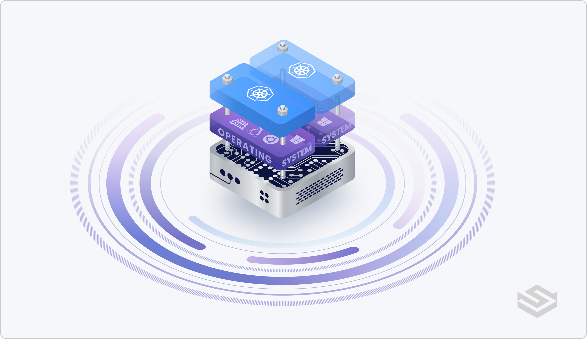
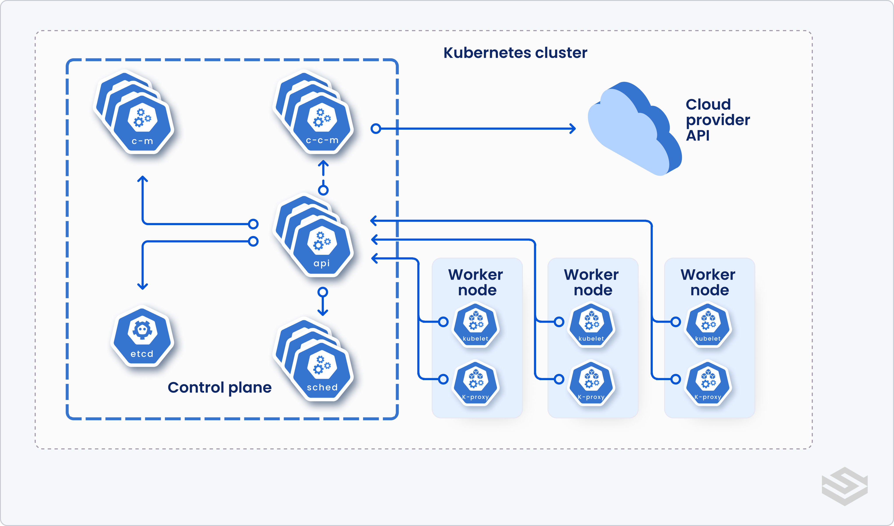
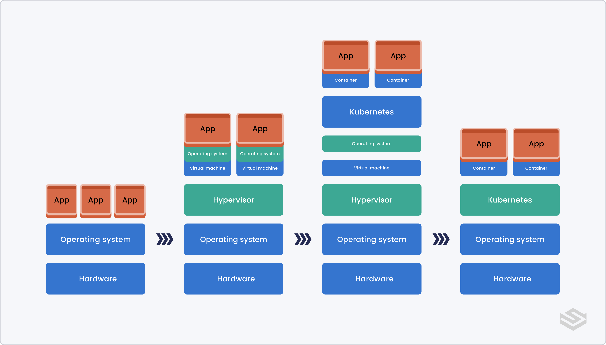
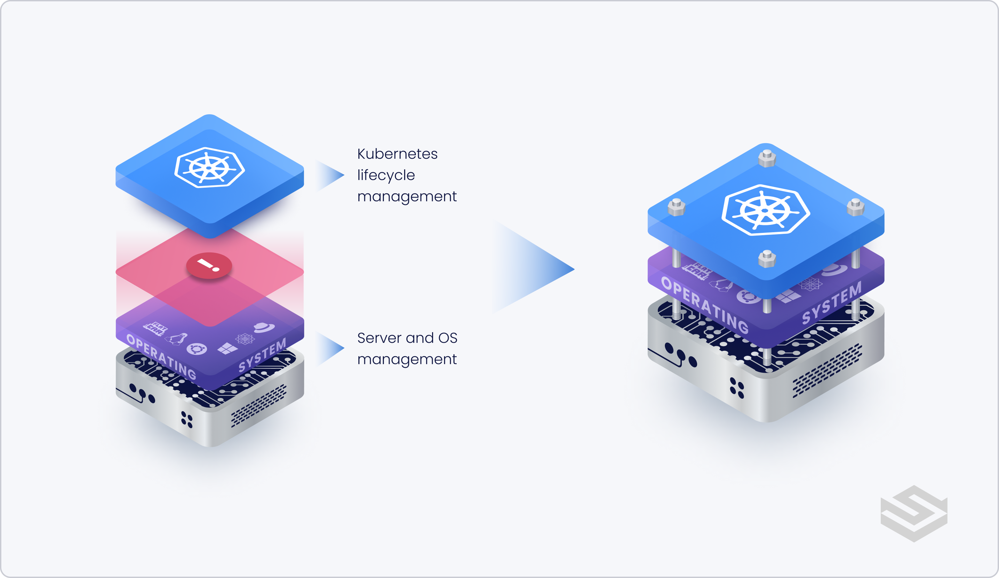

> 本文是 [Introducing Bare Metal Kubernetes: what you need to know](https://www.spectrocloud.com/blog/introducing-bare-metal-kubernetes-what-you-need-to-know) 的中文翻译版本，内容有删减

Bare Metal Kubernetes意味着直接在物理服务器上部署Kubernetes集群及其容器，而不是在由管理器层管理的传统虚拟机[VMs](https://info.spectrocloud.com/webinar-kubernetes-on-vmware/)内部进行部署。

Bare metal Kubernetes可以用于边缘计算部署，以避免在小型硬件上运行虚拟机层所带来的开销，或者用于数据中心以降低成本，提高应用工作负载性能，并避免虚拟机许可的成本。
正如我们将讨论的，历史上在Bare metal上部署Kubernetes一直存在挑战。 Spectro Cloud的[研究发现](https://info.spectrocloud.com/report-kubernetes-2022)，仅有20%的企业级Kubernetes的使用者使用Bare metal。 但是借助[Cluster API和Canonical MaaS](https://www.spectrocloud.com/blog/how-to-provision-bare-metal-k8s-clusters-with-cluster-api-and-canonical-maas)等工具，现在对Bare metal K8s集群进行配置要简单，可扩展和高效得多。
因此，我们看到越来越多的企业运营团队开始在他们的Kubernetes部署中使用裸金属。
继续阅读以获取有关裸金属Kubernetes的所有信息，包括其工作原理，与虚拟机的比较，以及如何开始自己的裸金属部署。

Kubernetes是什么?
-------------------------------

在深入了解bare-metal Kubernetes之前，让我们通过 [what Kubernetes does](https://kubernetes.io/docs/tutorials/kubernetes-basics/)简单的看一下Kubernetes的功能

Kubernetes是一个开源的容器编排引擎，它目前是使用最广的，超过其他所有替代产品。来自云原生计算基金会（CNCF）的[研究发现](https://www.cncf.io/wp-content/uploads/2022/02/CNCF-AR_FINAL-edits-15.2.21.pdf)，96%的受访者正在考虑或使用Kubernetes。

### Kubernetes是一个容器编排引擎

Kubernetes 的主要任务是调度和部署容器化应用程序，这是云原生模型的关键要素之一。与 VM 相比，容器是轻量级的，因为它们不包含操作系统，并且它们是可移植的，因为它们包含所有应用程序的依赖项。

您无需严格使用 Kubernetes 就可以运行容器，因为您可以使用容器运行时手动将容器部署在服务器的操作系统上。但是，除非您只有少数容器要处理，否则这种方法并不实用。如果您想扩展，则需要一个编排引擎。

### Scaling with clusters and worker nodes

Kubernetes 的作用就在于此。它通过 Kubernetes API 将容器部署到由单个“master node”控制平面管理的“worker node”集群中的“pod”上，并根据需要进行扩展。

Kubernetes 非常强大，这要归功于其可扩展的架构。为了实现高可用性和负载平衡，Kubernetes 会根据需要启动和关闭尽可能多的worker nodes。它会根据策略和用户需求将应用程序分布在它们之上。

例如，如果节点出现故障或遇到其他问题，Kubernetes 可以workload移植到其他node，从而防止停机。

Bare metalKubernetes 的不同之处在于?
-------------------------------------------

Kubernetes 和容器是在虚拟机成为部署应用程序的事实环境中出现的。自然而然，大多数企业一直在 VM 上部署容器和 Kubernetes，而 VM 又位于硬件上的管理程序层和主机操作系统之上（让我们不要深入探讨bare-metal管理程序的概念……）。

相反，裸金属 Kubernetes 删除了 VM 层及其管理程序开销，并将 Kubernetes 安装直接置于主机服务器的操作系统 (OS) 上。

这意味着运行在bare-metal Kubernetes 集群中的容器可以直接访问底层的服务器硬件。在由虚拟机组成的集群中，情况并非如此，因为虚拟机会将容器从底层的服务器硬件中抽象出来。

值得注意的是，裸金属 Kubernetes 可以发生在各种不同的环境中：

- 在本地服务器上，部署在传统服务器室或数据中心中
- 在托管服务提供商、公共云或托管服务（如 Hivelocity: https://www.hivelocity.net/）提供的托管裸金属服务上。
- 在各种边缘硬件上，包括 Raspberry Pis: https://www.raspberrypi.org/ 到 1U 机架服务器或小型设备，或者存在点 (PoP) 中的电信边缘服务器。

**“因此，bare-metal Kubernetes 可以容纳任何类型的云架构或托管模式 - 本地、公共云、多云或混合云。只要 Kubernetes 直接部署在服务器操作系统上，它就是bare-metal。”**

 Bare Metal相对于Virtual Machines的优势
-------------------------------------------------

澄清一下： 从 Kubernetes 本身来看，集群中服务器的类型并不重要。

Kubernetes 会顺畅地编排您的容器，而不管底层服务器是什么。事实上，Kubernetes 甚至没有设计成能够识别 Bare Metal或 VM 之间的区别，更不用说以不同的方式对待它们了。

然而，这并不意味着选择裸金属服务器不会对您的 Kubernetes 环境产生任何影响。相反， Bare Metal方法的 Kubernetes 可以提供几个关键优势。

### 无需hypervisor的更高性能

对于许多工作负载，裸金属 Kubernetes 会带来更高的整体性能，原因有两个。

- 首先：由于裸金属集群没有虚拟化管理程序层（消耗资源），因此可供workload使用的资源更多。这通常会带来更好的整体性能，尤其是在接近最大化总基础设施容量的工作负载情况下。

- 其次：它允许容器访问主机服务器上的裸金属硬件资源，例如 GPU。大多数应用程序不需要这些资源，但某些类型的应用程序 - 例如那些使用 GPU : https://www.spectrocloud.com/blog/vGPUs-in-kubernetes-land 加速数据分析操作的应用程序 - 在这种类型的环境中运行会更快得多。

### 降低许可成本和复杂性

Bare-metal Kubernetes 并不一定会降低整体成本。根据您运行的工作负载和硬件设置，您可能会看到使用裸金属或虚拟化设置获得更高的资产利用率，因此您的硬件成本可能会上升或下降。

但很明显，通过消除hypervisor程序层，您可以避免许可成本，并可能避免其他费用，例如支持合同。

在我们的研究中，68% 的 Kubernetes 用户表示 Kubernetes 最终将消除为虚拟机管理程序层付费的需要。

您还可能会看到操作效率。在Bare-metal世界中，您的团队仍然需要配置和管理服务器硬件，并处理更换故障驱动器、网卡或 PSU（至少在本地或边缘场景中）等事情。但是您的团队不必设置或管理hypervisors管理程序和 VM 配置文件。从某种意义上说，您正在摆脱第二个编排层以及随之而来的复杂性和抽象性。

### 提高Kubernetes集群安全性和控制力

安全已成为 Kubernetes 用户最关心的[问题之一](https://thenewstack.io/top-challenges-kubernetes-users-face-deployment/)。尽管在bare metal上运行 Kubernetes 无法解决所有安全挑战，但它在赋予管理员对托管节点服务器的完全控制权方面具有优势。

您可以决定在服务器上运行哪个操作系统，要安装哪个安全强化框架（例如 [SELinux](https://web.mit.edu/rhel-doc/5/RHEL-5-manual/Deployment_Guide-en-US/ch-selinux.html) 或 [AppArmor](https://apparmor.net/)），以及如何配置节点上的用户帐户以降低安全风险。

如果您在由他人（例如云提供商）管理的 VM 上运行 Kubernetes，那么您将无法获得对主机服务器的任何控制权；您只能控制 VM。

裸金属 Kubernetes 在以下方面也更安全：当每个节点作为独立服务器运行时，您不必担心物理服务器上的安全漏洞会影响多个节点。当您将多个节点作为 VM 运行在单个物理服务器上时，情况并非如此。在这种情况下，底层服务器上的安全问题可能会影响所有在其上运行的节点。

 bare-metal 的弊端
---------------------------------------

虽然裸金属 Kubernetes 具有明显的优势，但也存在一些弊端：

- 配置服务器： 配置服务器可能更困难。您需要使用不同的方法配置每个裸金属机器，而不是部署 VM 映像来设置服务器。像 Canonical MAAS 或 Tinkerbell Cluster API Provider 这样的工具可以提供帮助，但该过程仍然可能比设置基于 VM 的集群更复杂。

- 日常运营： 我们已经说过，Kubernetes 本身并不关心底层的服务器硬件和操作系统。没有虚拟化层来管理硬件和操作系统，您如何管理操作系统并执行日常运营任务，例如操作系统更新和修补？

- 备份和迁移： 出于类似的原因，备份裸金属服务器或将其迁移到不同硬件可能会更具挑战性。您不能简单地拍摄 VM 快照或执行基于映像的备份。

- 节点故障： 当您将每个节点作为独立服务器运行时，实际上您是在将许多“鸡蛋”（或容器）放在一个“篮子”（或服务器）中。例如，一个节点的故障（由于操作系统内核崩溃等问题）会导致托管在该节点上的所有容器崩溃。使用虚拟机 (VM)，您可以将单个bare-metal服务器“切成小块”划分为多个节点。因此，如果节点发生故障，其余节点（以及托管在底层服务器上的容器）将继续运行。

### bare-metal Kubernetes 是否适合您？

Bare-metal Kubernetes 是一种策略，可以让团队充分利用裸金属基础设施来托管容器化工作负载。我们坚持 我们的预测，即它将越来越受欢迎: https://www.spectrocloud.com/blog/three-key-predictions-about-enterprise-kubernetes-you-should-know-about。我们已经看到一些 像 T-Mobile 这样的公司: https://info.spectrocloud.com/bare-metal-kubernetes-as-a-service 对他们获得的结果感到兴奋。但它是否适合您的 Kubernetes 用例？

要回答这个问题，您必须根据工作负载要求和团队的专业水平确定优势是否大于劣势。

如果您的工程师习惯于使用裸金属硬件并且可以简化配置和管理过程，那么裸金属方法可能很适合您。如果您的工作负载可以从访问裸金属基础设施中以特殊方式受益，例如可以直接访问 GPU，那就更合适了。