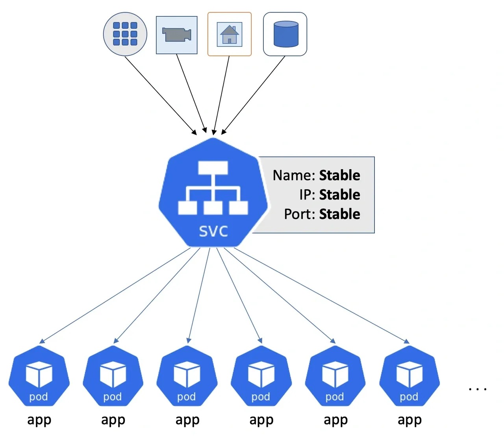
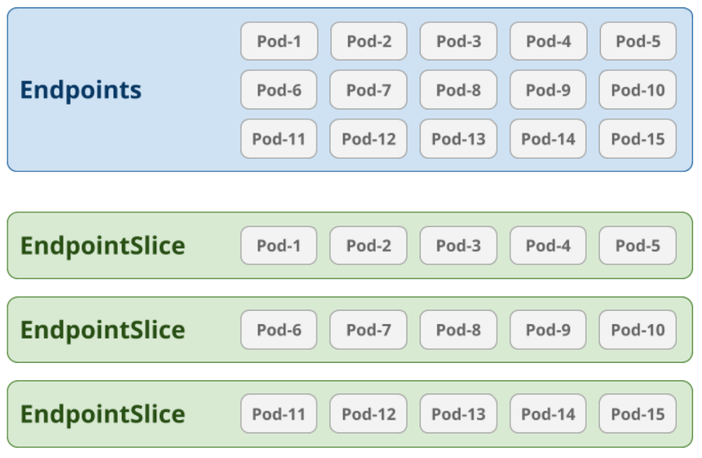

# 背景
## Endpoints 弊端


>引用来自[Scaling Kubernetes Networking With EndpointSlices](https://kubernetes.io/blog/2020/09/02/scaling-kubernetes-networking-with-endpointslices/)

使用[Endpoints](https://kubernetes.io/docs/concepts/services-networking/service/#endpoints)时，一个Service只有一个Endpoints资源。这意味着它需要能够存储为每个支持相应Service的Pod的IP地址和端口（网络端点）。这导致API资源非常庞大。加剧这个问题的是，kube-proxy在每个节点上运行，并监视Endpoints资源的任何更新。如果Endpoints资源中的一个网络端点发生变化，整个对象都必须发送到每个kube-proxy实例。

Endpoints API的另一个限制是它限制了可以为一个Service跟踪的网络端点数量。**在etcd中存储的对象的默认大小限制为1.5MB。在某些情况下，这可能将Endpoints资源限制为5,000个Pod IP。** 对于大多数用户来说，这不是一个问题，但对于接近这个规模的Service的用户来说，这将成为一个重大问题。

为了说明这些问题在规模上的重要性，我们可以举一个简单的例子。**想象一个有5,000个Pod的Service，它可能得到一个1.5MB的Endpoints资源。如果列表中的任何一个网络端点发生变化，完整的Endpoints资源将需要分发到集群中的每个节点。在一个拥有3,000个节点的大型集群中，这会成为一个相当大的问题。每次更新都需要在集群中传输4.5GB的数据（1.5MB Endpoints * 3,000个节点）。这几乎足够填满一张DVD，并且每次Endpoints变更都会发生这种情况。**想象一下进行滚动更新，导致所有5,000个Pod被替换 - 这将传输超过22TB（或5,000张DVD）的数据。


## EndpointSlice介绍

[EndpointSlice](https://kubernetes.io/docs/concepts/services-networking/endpoint-slices/)是Kubernetes引入的一种新的资源类型，用于替代传统的Endpoints资源，以解决在大规模集群中Endpoints资源所面临的问题。通过使用EndpointSlice，可以解决以下问题：

- API资源规模：传统的Endpoints资源在存储所有Pod的IP地址和端口时会导致资源规模庞大。EndpointSlice允许将这些信息分片存储，从而减小每个资源对象的大小，提高扩展性。

- 更新成本：传统的Endpoints资源在更新时需要将整个对象发送到集群中的每个节点，这会导致大量的数据传输。使用EndpointSlice，只有在实际变化发生时才需要传输更新的部分，减少了传输的数据量和成本。

- 数量限制：传统的Endpoints资源对于可以跟踪的Pod IP数量有限制。EndpointSlice通过支持更大的对象大小限制，解除了这个限制，可以跟踪更多的Pod IP。

## Yaml示例
### Service yaml
下面是一个Service的yaml示例，它指定了对应Pod的selector `k8s-app: kubernetes-dashboard`和响应的端口信息 `targetPort: 9090`。

```yaml
(base)  ~/ mk get svc -n kubernetes-dashboard kubernetes-dashboard -o yaml
apiVersion: v1
kind: Service
metadata:
  annotations:
    kubectl.kubernetes.io/last-applied-configuration: |
      {"apiVersion":"v1","kind":"Service","metadata":{"annotations":{},"labels":{"addonmanager.kubernetes.io/mode":"Reconcile","k8s-app":"kubernetes-dashboard","kubernetes.io/minikube-addons":"dashboard"},"name":"kubernetes-dashboard","namespace":"kubernetes-dashboard"},"spec":{"ports":[{"port":80,"targetPort":9090}],"selector":{"k8s-app":"kubernetes-dashboard"}}}
  creationTimestamp: "2023-05-15T14:28:09Z"
  labels:
    addonmanager.kubernetes.io/mode: Reconcile
    k8s-app: kubernetes-dashboard
    kubernetes.io/minikube-addons: dashboard
  name: kubernetes-dashboard
  namespace: kubernetes-dashboard
  resourceVersion: "428"
  uid: de15f58c-79dd-4f4e-a6f3-4c5bd1806201
spec:
  clusterIP: 10.110.249.111
  clusterIPs:
  - 10.110.249.111
  internalTrafficPolicy: Cluster
  ipFamilies:
  - IPv4
  ipFamilyPolicy: SingleStack
  ports:
  - port: 80
    protocol: TCP
    targetPort: 9090
  selector:
    k8s-app: kubernetes-dashboard
  sessionAffinity: None
  type: ClusterIP
status:
  loadBalancer: {}
```
### Ednpoints yaml
下面是一个Endpoints的yaml示例，它是由上面的Service自动生成的。它包含了对应Pod的IP地址和端口信息，同时subsets中包含了响应的Pod信息。
```yaml
(base)  ~/ mk get ep -n kubernetes-dashboard kubernetes-dashboard -o yaml
apiVersion: v1
kind: Endpoints
metadata:
  annotations:
    endpoints.kubernetes.io/last-change-trigger-time: "2023-05-15T14:28:09Z"
  creationTimestamp: "2023-05-15T14:28:09Z"
  labels:
    addonmanager.kubernetes.io/mode: Reconcile
    k8s-app: kubernetes-dashboard
    kubernetes.io/minikube-addons: dashboard
  name: kubernetes-dashboard
  namespace: kubernetes-dashboard
  resourceVersion: "110918"
  uid: 460c7a02-f48e-49f8-b9be-d001c024c9ba
subsets:
- addresses:
  - ip: 10.244.0.12
    nodeName: minikube
    targetRef:
      kind: Pod
      name: kubernetes-dashboard-f87d45d87-s65jb
      namespace: kubernetes-dashboard
      uid: 39dc5ba8-df5d-4220-95b4-e887289ebf0a
  ports:
  - port: 9090
    protocol: TCP
```
### EndpointSlice yaml
下面是一个EndpointSlice的yaml示例，它是由上面的Endpoints自动生成的。它包含了对应Pod的IP地址和端口信息，同时subsets中包含了响应的Pod Conditions信息，当前的pod的condition是`ready`和`serving`。
关于condition的详细信息可以参考[这里](https://kubernetes.io/docs/concepts/services-networking/endpoint-slices/#address-types)。

同时我们还可以看到当前的enpointslice的`ownerReferences`和`kubernetes.io/service-name`都表明了它是由`kubernetes-dashboard`这个service生成的。
```yaml
(base)  ~/ mk get endpointslice -n kubernetes-dashboard kubernetes-dashboard-jddr4 -o yaml
addressType: IPv4
apiVersion: discovery.k8s.io/v1
endpoints:
- addresses:
  - 10.244.0.12
  conditions:
    ready: true
    serving: true
    terminating: false
  nodeName: minikube
  targetRef:
    kind: Pod
    name: kubernetes-dashboard-f87d45d87-s65jb
    namespace: kubernetes-dashboard
    uid: 39dc5ba8-df5d-4220-95b4-e887289ebf0a
kind: EndpointSlice
metadata:
  annotations:
    endpoints.kubernetes.io/last-change-trigger-time: "2023-05-15T14:28:09Z"
  creationTimestamp: "2023-05-15T14:28:09Z"
  generateName: kubernetes-dashboard-
  generation: 4
  labels:
    addonmanager.kubernetes.io/mode: Reconcile
    endpointslice.kubernetes.io/managed-by: endpointslice-controller.k8s.io
    k8s-app: kubernetes-dashboard
    kubernetes.io/minikube-addons: dashboard
    kubernetes.io/service-name: kubernetes-dashboard
  name: kubernetes-dashboard-jddr4
  namespace: kubernetes-dashboard
  ownerReferences:
  - apiVersion: v1
    blockOwnerDeletion: true
    controller: true
    kind: Service
    name: kubernetes-dashboard
    uid: de15f58c-79dd-4f4e-a6f3-4c5bd1806201
  resourceVersion: "110915"
  uid: c797bd8e-8646-4158-a032-aff6dfe7ac10
ports:
- name: ""
  port: 9090
  protocol: TCP
```

## 参考文献
- [endpoint-slices](https://kubernetes.io/docs/concepts/services-networking/endpoint-slices)
- [scaling-kubernetes-networking-with-endpointslices](https://kubernetes.io/blog/2020/09/02/scaling-kubernetes-networking-with-endpointslices/)
- [Service](https://kubernetes.io/docs/concepts/services-networking/service/#endpoints)
