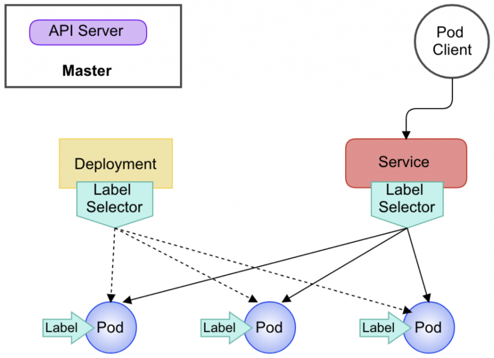

WIP
# Background


Kubernetes（简称K8S）是一种开源的容器编排系统，用于自动化管理、部署和扩展容器化应用程序。K8S是云原生架构的核心组件之一，它可以帮助开发人员更轻松地构建和管理云原生应用程序。K8s还提供了许多高级功能，例如负载均衡、服务发现、自动伸缩、存储管理等，这些功能可以帮助开发人员更轻松地构建可靠的云原生应用程序。

虽然K8S是一个强大的容器编排系统，但它仍然存在一些缺点，包括以下几个方面：

1. **学习曲线较陡峭**：Kubernetes是一个非常复杂的系统，它需要掌握大量的概念和技术，包括容器、Pod、服务发现、负载均衡、存储、网络等。因此，对于初学者来说，学习曲线可能比较陡峭。
2. **部署和管理复杂度较高**：虽然Kubernetes提供了许多工具来简化部署和管理，但这些工具仍然需要较高的技术水平来使用。此外，由于Kubernetes是一个分布式系统，因此在规划、部署和管理方面都需要进行复杂的决策和操作。
3. **资源占用较高**：Kubernetes需要运行在一个较为庞大的基础设施上，因此它需要占用相对较高的资源，包括CPU、内存、存储等。此外，Kubernetes还需要运行多个组件和代理，这些组件和代理也会占用一定的资源。
4. **容易出现故障**：由于Kubernetes是一个复杂的分布式系统，因此它容易出现故障和问题。这些故障可能涉及各个方面，包括网络、存储、节点故障等。此外，由于Kubernetes的架构复杂，排查问题也可能需要较长的时间和技术支持。
5. **不适合小规模应用**：由于Kubernetes需要占用较高的资源和运行多个组件，因此它对于小规模应用来说可能过于复杂和冗余。对于一些简单的应用，使用Kubernetes可能并不划算

如果你是一个不了解 K8S的开发人员，那么本文将从具体的使用的角度来帮助你学习和理解K8S。在学习 Kubernetes 之前，先了解一些基础概念

## Load Balancing

负载均衡（Load Balancing）是一种在计算机网络中分配工作负载的技术，其主要目的是提高应用程序的可用性、性能和可伸缩性。当网络流量过大时，负载均衡可以通过将负载分配到多个服务器上来减轻单个服务器的压力，并确保所有服务器能够合理地处理请求。

负载均衡在现代应用程序和网络中起着至关重要的作用，特别是在高流量、高负载的情况下。它可以确保应用程序的可用性和可靠性，并提高用户体验。负载均衡技术在云计算和分布式系统中也得到广泛的应用，成为了构建高可用性、高性能和高可扩展性系统的重要基础。

### 客户端/服务端负载均衡

**客户端负载均衡**


图片来源（[https://laptrinhx.com/go-microservices-part-7-service-discovery-and-load-balancing-2345614758/](https://laptrinhx.com/go-microservices-part-7-service-discovery-and-load-balancing-2345614758/)）

客户端负载均衡（Client-side Load Balancing）是一种在分布式系统中常用的负载均衡技术，它可以将请求从客户端分发到多个服务器，以提高系统的性能、可伸缩性和可用性。客户端负载均衡通常是通过在客户端应用程序中实现的，而不是在服务器端实现的。

在客户端负载均衡中，客户端应用程序会维护一个服务器列表，并根据负载均衡算法选择一个服务器来发送请求。负载均衡算法可以根据服务器的负载情况、网络延迟等因素来选择服务器，以实现最优的负载均衡效果。客户端应用程序还可以定期从服务发现中心获取服务器列表，并使用心跳检测等机制来监测服务器的可用性。常见的客户端负载均衡实现有 [Spring Cloud LoadBalancer](https://spring.io/guides/gs/spring-cloud-loadbalancer/) , [consul](https://www.consul.io/), [nacos](https://github.com/alibaba/nacos) 和[istio](https://istio.io/)

**服务端负载均衡**


图片来源（[https://laptrinhx.com/go-microservices-part-7-service-discovery-and-load-balancing-2345614758/](https://laptrinhx.com/go-microservices-part-7-service-discovery-and-load-balancing-2345614758/)）

服务端负载均衡（Server-side Load Balancing）是指通过在服务端引入负载均衡器（Load Balancer），将客户端请求分发到多个后端服务实例中，从而实现服务的高可用和高性能。通常，负载均衡器会根据不同的负载均衡算法（例如轮询、随机等）将客户端请求分配到后端的服务实例上。

服务端负载均衡器通常位于服务端的网络边缘，作为客户端和后端服务实例之间的中间层。它可以同时处理大量的客户端请求，并将请求转发到多个后端服务实例上，从而提高系统的处理能力和可靠性。同时，负载均衡器还可以实现一些高级功能，如故障检测、动态配置、流量控制等。常见的硬件负载均衡的厂家有 [F5 BIG-IP](https://www.f5.com/products/big-ip-services)，[Citrix NetScaler](https://docs.netscaler.com/en-us/citrix-adc.html)，[Barracuda Load Balancer](https://www.barracuda.com/products/application-cloud-security/load-balancer) 和 [A10 Networks Thunder](https://www.a10networks.com/products/thunder-adc/)

**服务端和客户端负载均衡对比**

服务端负载均衡和客户端负载均衡各有优缺点：

1. 负载均衡器的位置：服务端负载均衡器位于服务端，而客户端负载均衡器位于客户端。
2. 负载均衡器的数量：服务端负载均衡器通常是单个或少数几个，而客户端负载均衡器可以有多个，每个客户端都可以有自己的负载均衡器。
3. 服务实例列表的维护：服务端负载均衡器负责维护服务实例列表，而客户端负载均衡器需要从服务端获取服务实例列表或者自己维护服务实例列表。
4. 网络通信量：服务端负载均衡器需要将请求从客户端转发到服务实例，这可能会增加网络通信量。而客户端负载均衡器通常只需要在本地选择一个服务实例来处理请求，因此可以减少网络通信量。
5. 系统可用性：客户端负载均衡器无法动态地响应服务端的变化，一旦服务实例状态发生变化，客户端负载均衡器可能会选择到不可用的服务实例。而服务端负载均衡器可以及时响应服务实例的变化，从而提高系统的可用性。
6. 性能瓶颈：服务端负载均衡器可能成为性能瓶颈，而客户端负载均衡器通常可以在本地快速选择一个服务实例来处理请求，从而减少性能瓶颈的风险。

综上所述，服务端负载均衡和客户端负载均衡各有优缺点，需要根据具体业务场景和需求选择合适的负载均衡方式。服务端负载均衡适合服务实例数量较大、集中管理的场景，而客户端负载均衡适合服务实例数量较小、分散的场景。

### L4/L7 负载均衡


图片来源（《计算机网络第七版》谢希仁）
计算机网络体系结构


OSI 七层模型和数据

图片来源（[https://icyfenix.cn/architect-perspective/general-architecture/diversion-system/load-balancing.html](https://icyfenix.cn/architect-perspective/general-architecture/diversion-system/load-balancing.html)）

**四层负载均衡**

L4负载均衡是在OSI模型的第四层（即传输层）上进行负载均衡的。这种负载均衡方式通常基于IP地址和端口号进行负载分配，将请求分配到后端服务器的方法通常是基于传输控制协议（TCP）连接的状态信息进行分配。这种方式通常速度较快，因为它不需要解析应用程序数据，但它对于不同的应用程序可能不是非常智能化，因为它无法解析HTTP等应用层协议的数据。

**七层负载均衡**

L7负载均衡是在OSI模型的第七层（即应用层）上进行负载均衡的。这种方式通过解析应用程序数据（如HTTP头部信息）来实现请求的分配，因此可以更智能地决定请求的分配方式。例如，可以根据请求的URL、请求头、请求体中的内容等信息来进行分配。这种方式通常需要较多的计算资源，因为它需要解析应用程序数据，但它可以更智能地分配请求并更好地适应应用程序层面的需求。

总的来说，L4负载均衡适用于需要快速响应的高吞吐量应用程序，而L7负载均衡适用于需要更智能的负载分配方式的应用程序。关于L4和L7更详细的介绍请参考[凤凰架构-负载均衡](https://icyfenix.cn/architect-perspective/general-architecture/diversion-system/load-balancing.html)。

### LVS负载均衡

LVS（Linux Virtual Server）是一种开源的负载均衡软件，它是在Linux操作系统上实现的。LVS可以通过多种负载均衡算法将客户端请求分发到多个后端服务器，从而提高系统的可用性和可扩展性。LVS主要有三种负载均衡技术：NAT、IP隧道和直接路由（Direct Routing）。

**NAT（Network Address Translation）**：在这种负载均衡模式下，LVS将客户端请求的源IP地址和端口号修改为LVS节点的IP地址和端口号，然后将请求转发到后端服务器。当后端服务器将响应发送回LVS节点时，LVS节点会将响应的目标IP地址和端口号修改为客户端的IP地址和端口号，然后将响应发送给客户端。


图片来源（[https://cloud.tencent.com/developer/article/1619664](https://cloud.tencent.com/developer/article/1619664)）

**IP隧道（IP Tunneling）**：在这种负载均衡模式下，LVS会将客户端请求封装在一个IP隧道中，并将隧道中的请求发送到后端服务器。当后端服务器将响应发送回LVS节点时，LVS节点会将响应封装在一个IP隧道中，并将隧道中的响应发送给客户端。


图片来源（[https://cloud.tencent.com/developer/article/1619664](https://cloud.tencent.com/developer/article/1619664)）

**直接路由（Direct Routing）**：在这种负载均衡模式下，LVS会将客户端请求的目标IP地址和端口号修改为后端服务器的IP地址和端口号，然后将请求发送到后端服务器。当后端服务器将响应发送回LVS节点时，LVS节点会将响应直接发送给客户端。


图片来源（[https://cloud.tencent.com/developer/article/1619664](https://cloud.tencent.com/developer/article/1619664)）

LVS提供了多种负载均衡算法，如轮询、最少连接数等。LVS还支持多种协议，如TCP、UDP、HTTP等。LVS是一个成熟、稳定的负载均衡软件，被广泛应用于互联网和企业内部的各种应用程序。关于LVS更加详细的介绍读者可查看 [LVS内核原理与LVS十种调度算法](https://cloud.tencent.com/developer/article/1619664)

## K8S相关概念

下面是关于k8s的基础组件的简要介绍：

### K8S基础概念

Pod：Pod 是 Kubernetes 中最小的可部署单元，它是一个可以包含一个或多个容器的逻辑主机。Pod 中的容器共享网络和存储资源，并可以通过 localhost 相互通信。Pod 旨在为容器提供一个较小的运行环境，将容器的生命周期、网络、存储等方面进行了抽象，使得开发人员更方便地管理和部署容器化应用


**Deployment**

Deployment是一种管理Pod副本的抽象概念，它可以用来定义一个应用程序的副本数量、Pod的模板以及更新策略等信息。Deployment通过创建和管理ReplicaSet来控制Pod的数量，并根据需要调整Pod的数量，以确保应用程序在集群中的副本数始终保持在指定的范围内，以满足应用的负载需求。


**Service**

Service 是一种可以提供稳定网络端点的抽象，它可以将一个或多个 Pod 组合成一个服务。Service可以通过标签选择器来选择一组 Pod，并将它们作为一个服务暴露出去，从而让其他应用程序可以通过这个服务来访问这些 Pod。使用SVC，开发人员可以实现应用程序的发现和负载均衡，而无需了解后端 Pod 的具体信息



**ConfigMap 和 Secret**

ConfigMap 和 Secret 是 Kubernetes 中用于管理应用配置和敏感数据的资源。ConfigMap 可以管理应用的配置信息，例如数据库地址、端口号等；Secret 可以管理敏感数据，例如密码、API 密钥等。这些资源可以通过环境变量、配置文件、命令行参数等方式注入到应用中


想要深入了解 K8S的读者可以查看 [Kubernetes 基础教程](https://lib.jimmysong.io/kubernetes-handbook/architecture/perspective/#kubernetes-%E8%AE%BE%E8%AE%A1%E7%90%86%E5%BF%B5%E4%B8%8E%E5%88%86%E5%B8%83%E5%BC%8F%E7%B3%BB%E7%BB%9F) 和 [Kubernetes 文档](https://kubernetes.io/docs/concepts/)

### kube-proxy

前文提到Service为一组Pod提供了一个稳定的、虚拟的IP地址和DNS名称，具有负载均衡的功能。Service的负载均衡是基于L4负载均衡实现的。具体而言，Kube-proxy会根据请求的目标IP地址和端口，将请求转发到相应的后端Pod。这是一个基于TCP/UDP协议的转发过程，因此被称为四层负载均衡。在转发过程中，Kube-proxy会维护一些iptables或IPVS规则，根据这些规则来实现负载均衡和服务发现的功能。因此接下来介绍一些Kube-proxy的实现原理。


Kube-proxy在Kubernetes集群的每个Node节点上运行，它通常作为一个独立的进程来运行，Kube-proxy进程可以通过 daemonset 或者 static pod 的方式运行。Kube-proxy通过监视Kubernetes API服务器上的Service和Endpoint对象的变化，自动更新集群节点上的iptables规则或ipvs规则，从而实现了负载均衡和服务发现的功能。

```go
+------------------------+
           |    Kubernetes API      |
           |    Server              |
           +-----------+------------+
                       |
                       | watch Service/Endpoint
                       v
           +-----------+------------+
           |        Kube-proxy      |
           | (iptables or IPVS mode)|
           +-----------+------------+
                       |
                       | update iptables/IPVS rules
                       v
           +-----------+------------+
           |       Pod Endpoint     |
           +------------------------+
```

Kube-proxy提供了三种代理模式：

- userspace模式：将Service的Cluster IP地址映射到一个本地未使用的端口，并在本地监听该端口，以接受请求。这种模式是最早的代理模式，但因其性能较差，已经不再推荐使用。
- iptables模式：将Service的Cluster IP地址映射到iptables规则，然后将请求转发到后端Pod。这种模式比userspace模式性能更好，同时也更稳定。


图片来源（[https://docs.google.com/drawings/d/1MtWL8qRTs6PlnJrW4dh8135_S9e2SaawT410bJuoBPk/edit](https://docs.google.com/drawings/d/1MtWL8qRTs6PlnJrW4dh8135_S9e2SaawT410bJuoBPk/edit)）

ipvs模式：使用Linux内核的IPVS（IP Virtual Server）技术来实现负载均衡和服务发现。这种模式性能更好，但需要在节点上安装额外的软件包。

# application

在了解完前面的基础内容以后，接下来我们开始通过从应用的角度把前面K8S的知识串起来理解，首先加入我们的目标

## Running with stateful application like mysql (TBD)

## Running with stateless application like HTTP server (TBD)

首先假设我们的目标应用是常见的无状态应用开始，无状态应用是指在运行过程中不维护任何会话或状态信息的应用程序，每个请求都是独立的。这意味着应用程序可以随时被复制或迁移到不同的节点，而不会影响应用程序的功能或性能。


# 参考文献

- [Go Microservices, Part 7: Service Discovery and Load Balancing](https://laptrinhx.com/go-microservices-part-7-service-discovery-and-load-balancing-2345614758/)
- [https://laptrinhx.com/go-microservices-part-7-service-discovery-and-load-balancing-2345614758/](https://laptrinhx.com/go-microservices-part-7-service-discovery-and-load-balancing-2345614758/)
- [https://cloud.tencent.com/developer/article/1769822](https://cloud.tencent.com/developer/article/1769822)
- [http://docs.kubernetes.org.cn/117.html](http://docs.kubernetes.org.cn/117.html)
- [https://mp.weixin.qq.com/s/3LGRf9NMs9qkMlGvTqVAcA](https://mp.weixin.qq.com/s/3LGRf9NMs9qkMlGvTqVAcA)
- [https://kubernetes.feisky.xyz/concepts/components/kube-proxy](https://kubernetes.feisky.xyz/concepts/components/kube-proxy)
- [https://llussy.github.io/2019/12/12/kube-proxy-IPVS/](https://llussy.github.io/2019/12/12/kube-proxy-IPVS/)
- [https://developer.aliyun.com/article/727651](https://developer.aliyun.com/article/727651)
- [https://galaxyyao.github.io/2019/06/26/容器-10-Kubernetes实战-Service/](https://galaxyyao.github.io/2019/06/26/%E5%AE%B9%E5%99%A8-10-Kubernetes%E5%AE%9E%E6%88%98-Service/)
- [https://www.weave.works/blog/introduction-to-service-meshes-on-kubernetes-and-progressive-delivery](https://www.weave.works/blog/introduction-to-service-meshes-on-kubernetes-and-progressive-delivery)
- [https://in4it.io/kubernetes-secrets-management/](https://in4it.io/kubernetes-secrets-management/)
- [https://arthurchiao.art/blog/cracking-k8s-node-proxy/#2-kubernetes-node-proxy-model](https://arthurchiao.art/blog/cracking-k8s-node-proxy/#2-kubernetes-node-proxy-model)