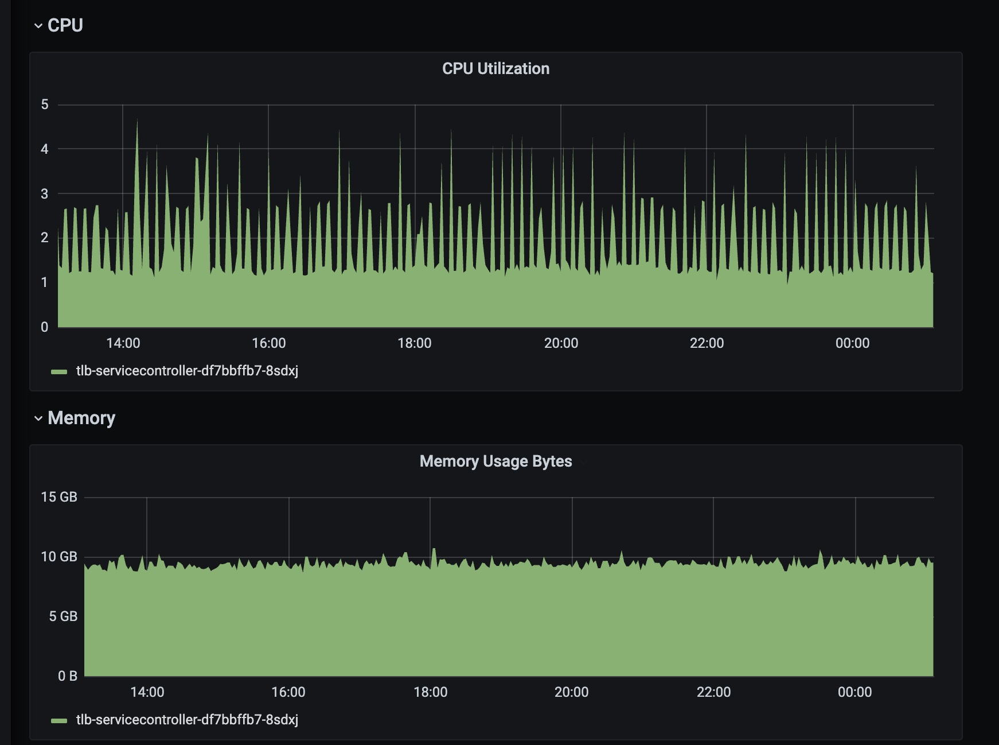

# Client-go 中的label selector 引起的 **CPU Throttling**问题

## 前序

最近，我作为团队的值班人员，接到关于公司内部 tlb-service-controller 的告警电话。快速查看后发现问题是 **CPU Throttling**** 导致 tlb-service-controller 重启。以下是对问题的排查过程和解决方案的记录。

## **CPU Throttling** **问题排查**
#### 收到告警电话，扩容CPU

``` shell
10-->20-->40 CPU 扩容的过程
```


当我接到告警电话☎️时，发现当前 tlb-service-controller 的 CPU 限制设置为 10。最初认为是由于 controller 需要协调的对象太多，导致其无法正常工作。为了暂时解决问题，我将 CPU 限制从 10 增加到 20。然而，即使增加到 20，依然存在**CPU Throttling**的情况，于是我将 CPU 再次增加到 40。这样 tlb-service-controller 的 CPU 使用率稳定下来，上下游用户暂时不受影响。接下来，我将查找导致当前问题的原因


上图是在Prometheus上查看的当前tlb-service-controller在CPU扩容后的CPU和内存分布图。我们可以得出结论，**CPU使用率在短短的10分钟内迅速上升至约33**，怀疑是代码存在bug，某些程序占用了大量内存资源，而系统无法为其分配更多内存，从而导致CPU限制。

#### pprof 排查CPU 使用率罪魁祸首

pprof 是一款 Golang 性能剖析工具，可用于分析应用程序的 CPU 和内存占用率等性能问题。pprof 可以在应用程序运行时收集性能数据，然后使用可视化工具进行简单的分析和展示。下面是使用 pprof 对当前 tlb-service-controller 的 CPU 使用率采样生成的分析图。


从上面的图中，我们可以看到，主要的罪魁祸首是`lockAllocationForPods()`和client-go中cache的`ListAll()`函数。通过查看源代码，我们发现该函数通过client-go提供的标签选择器功能，在每个pod上创建一个标签选择器（labelSelector），找到与之匹配的allocation（读者可以忽略"allocation"的具体含义，它是与IP绑定的资源，每个pod应该对应一个IP）

``` go
func (p *TLBProvider) lockAllocationForPods(pods []v1.Pod, service *v1.Service) error {
	if pods == nil {
		return nil
	}
	for _, pod := range pods {
		// Check if allocation already exists for this pod
		labelSelector := labels.Set{
			PodNodeNameLabel:  pod.Spec.NodeName,
			PodNamespaceLabel: pod.Namespace,
			PodNameLabel:      pod.Name,
			PodUIDLabel:       string(pod.UID),
		}.AsSelector()

		allocations, err := p.allocationLister.List(labelSelector)
```

#### client-go 中的cache提供的源码分析

根据我之前的了解，在Kubernetes中，标签选择器（labelSelector）是一种强大的机制，用于从一组对象中选择一部分。同时，client-go是Kubernetes官方提供的Go客户端，而标签选择器（labelSelector）是client-go中的一个重要功能。client-go的cache是一种本地缓存，用于存储Kubernetes API响应的对象。缓存的主要作用是提高应用程序性能，通过避免每次访问Kubernetes API，从而减少网络延迟和请求负载，缓存可以提高应用程序的效率。

client-go的cache的ListAll()函数为什么会导致CPU Throttling呢？为了解决这个问题，我决定查看源代码。
```go
func ListAll(store Store, selector labels.Selector, appendFn AppendFunc) error {
	selectAll := selector.Empty()
	for _, m := range store.List() {
		if selectAll {
			// Avoid computing labels of the objects to speed up common flows
			// of listing all objects.
			appendFn(m)
			continue
		}
		metadata, err := meta.Accessor(m)
		if err != nil {
			return err
		}
		if selector.Matches(labels.Set(metadata.GetLabels())) {
			appendFn(m)
		}
	}
	return nil
}
```

从上面的源码我们可以看出，`ListAll()`其实是client-go从自己的Store中，使用给定的selector筛选的对象，并将它们附加到给定的列表(appendFn)中。
该函数通过遍历Store中的所有对象，对每个对象执行以下操作：
- 如果给定的selector为空，则跳过标签匹配操作并将对象附加到列表中
- 否则，通过元数据访问器(meta.Accessor)，获取对象的元数据，然后将对象的标签转换为标签集，并将该集合与selector进行匹配。如果对象的标签匹配给定的selector，则添加该对象到列表中。

> client-go的Store是client-go提供了一种抽象的对象缓存机制。在使用client-go时，用户通常首先创建一个Store，并通过它与API Server进行交互，以获得最新的对象状态。下一步，可以使用Watcher等工具从API Server监听对象状态的更改，并将这些更改更新到Store中，以保持其最新状态并进行缓存。这可以极大地提高应用程序的效率，避免向API Server频繁发起资源查询请求。

```Go
// Store is a generic object storage interface. Reflector knows how to watch a server
// and update a store. A generic store is provided, which allows Reflector to be used
// as a local caching system, and an LRU store, which allows Reflector to work like a
// queue of items yet to be processed.
//
// Store makes no assumptions about stored object identity; it is the responsibility
// of a Store implementation to provide a mechanism to correctly key objects and to
// define the contract for obtaining objects by some arbitrary key type.
type Store interface {
	Add(obj interface{}) error
	Update(obj interface{}) error
	Delete(obj interface{}) error
	List() []interface{}
	ListKeys() []string
	Get(obj interface{}) (item interface{}, exists bool, err error)
	GetByKey(key string) (item interface{}, exists bool, err error)

	// Replace will delete the contents of the store, using instead the
	// given list. Store takes ownership of the list, you should not reference
	// it after calling this function.
	Replace([]interface{}, string) error
	Resync() error
}
```


#### 分析CPU Throttling  原因

从前面的源码中我们可以看到，`ListAll()`的主要工作是从 `Store`中利用golang的`for`循环在逐一匹配对象是否特定的label，为什么会是 Throttling 的主要原因呢，笔者为此计算了一下当前对应的k8s上的allocation对象的数量

从前面的源代码中，我们可以看出`ListAll()`的主要任务是在for循环中从`Store`中逐个匹配对象。为什么会成为`CPU Throttling`主要原因呢？我计算了当前K8s上的allocation对象数量。

```shell
(base)  ~/ k get allocation -A | wc
  145457  436371 15367879
```
原来有约1.45万个allocation对象。根据前面的代码，对于每个pod，都需要遍历这1.45万个allocation对象。假设每个K8s的service下有100个pod，而每个cluster仅有10个这样的K8s service，操作次数将达到1450万次。这些操作都需要在CPU中执行，直接使得该函数成为CPU密集型操作，进而导致了CPU限制。更复杂的情况是，每个cluster的service数量远远超过10个，所以CPU使用率出现了Throttling。

## Throttling  解决过程
通过比较Pod和allocation对象，我发现它们之间有一个交叉字段，即IP。因此，可以通过IP将这两个对象关联起来。由于 client-go提供了 添加了自定义 `AddIndexers`的功能，具体可查看[An introduction to Go Kubernetes' informers](https://github.com/haitwang-cloud/blog/blob/main/kubernetes/k8s_informers.md#%E8%A7%A3%E5%86%B3%E6%96%B9%E6%A1%88--informers) 我们可以通过自定义`Indexers`来加快访问速度，比如下面是一个通过pod的IP而不是name和nameSpace来获取pod的例子
### Pod AddIndexers例子
```go
// arbitrary unique name for the new indexer
const ByIP = "IndexByIP"
func podIPIndexFunc(obj interface{}) ([]string, error) {
    pod, ok := obj.(*v1.Pod)
    if !ok {
        return nil, fmt.Errorf("object is not a Pod")
    }

    // Extract the IP addresses from the Pod and return them as a list of strings.
    var ipList []string
    for _, ip := range pod.Status.PodIPs {
        ipList = append(ipList, ip.IP)
    }
    return ipList, nil
}
```

#### 给informeer添加indexer
```go
podsInformer.AddIndexers(map[string]cache.IndexFunc{ByIP: podIPIndexFunc})
```

#### 通过给pod的IP来获取pod
```go
items, err := podsInformer.GetIndexer().ByIndex(ByIP, ip)
```

我仿照上面的方式实现了`IpamIndexByIPFunc`，并配置了相应的informer。

```go
const (
	IpamIndexByIP        = "IpamIndexByIP"
	Slash32SubnetSize = 32
)

### 实现IpamIndexByIPFunc
func IpamInexByIPFunc(obj interface{}) ([]string, error) {
	alloc, ok := obj.(*ipamv1.Allocation)
	if !ok {
		return nil, fmt.Errorf("object is not a Allocation")
	}

	// Extract the IP addresses from the ipamv1.Allocation and return them as a list of strings.
	var ipList []string
	for _, subNet := range alloc.Status.Subnets {
		if subNet != "" {
			ip, ipNet, err := net.ParseCIDR(subNet)
			if err != nil {
				return nil, fmt.Errorf("failed to parse subnet %s: %s", subNet, err.Error())
			}
			subnetSize, _ := ipNet.Mask.Size()
			if subnetSize == Slash32SubnetSize {
				ipList = append(ipList, ip.String())
			}
		}
	}
	return ipList, nil
}
```

最后改变`lockAllocationForPods()`即可
```go
func (p *TLBProvider) lockAllocationForPods(pods []v1.Pod, service *v1.Service) error {
	if pods == nil {
		return nil
	}
	for _, pod := range pods {
alloc:=allocationInformer.Informer().GetIndexer().ByIndex(common.IpamIndexByIP, pod.Status.PodIP)

```
上述方案需要注意的是，通过`AddIndexers`添加索引会带来一定的内存消耗。每个索引都需要占用一定的内存空间来存储索引数据结构。索引的内存消耗随着索引的数量、索引字段的数量和索引数据量的增加而增加。在决定是否使用索引时，应该权衡查询性能的提升和额外内存消耗之间的关系，以确保整体系统的性能和可用性。
### 测试结果



上图是才用了上面的`AddIndexers`方法后，tlb-service-controller的CPU使用率。我们可以看到，CPU使用率已经稳定在了1~4左右，和之前的40相比的话，性能提升了10倍以上。验证了我们的`IpamIndexByIP`修复是正确的。同时我们看到内存使用率的没有明显变化，这证明我们通过`AddIndexers`来通过空间换时间的方法，并不会带来额外的内存消耗。

## 总结
本文介绍了在Kubernetes中处理CPU Throttling问题的过程。通过使用自定义indexer，加速了对象的访问速度，从而避免了大量的CPU密集型操作，有效提升了系统性能。此次经历让我更深入理解了client-go的使用，以及如何在Kubernetes中解决性能问题。

## 参考文章
- [client-go：Indexer 源码分析](https://andblog.cn/3181) 
- [An introduction to Go Kubernetes' informers](https://github.com/haitwang-cloud/blog/blob/main/kubernetes/k8s_informers.md#%E8%A7%A3%E5%86%B3%E6%96%B9%E6%A1%88--informers)
- [index_test.go
](https://github.com/kubernetes/client-go/blob/b8a03ab933ab332affa308e107cac58ccc6f40f4/tools/cache/index_test.go)
- [shared_informer.go](https://github.com/kubernetes/client-go/blob/b8a03ab933ab332affa308e107cac58ccc6f40f4/tools/cache/shared_informer.go#L541)